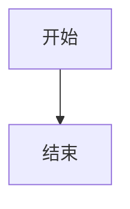

# 个人博客 · 使用指南

基于 [Astro](https://astro.build) 构建的静态个人博客，集成 GitHub 项目展示、MDX 文章、Mermaid 图表等功能。

---

## 快速开始

**依赖要求：** [Bun](https://bun.sh) >= 1.0.0（本项目只支持 bun，不支持 npm/yarn/pnpm）

```bash
# 安装依赖
cd web
bun install

# 启动开发服务器
bun run dev

# 构建生产版本
bun run build

# 预览构建结果
bun run preview
```

---

## 个人信息配置

编辑 `web/src/consts.ts`：

```ts
export const USER_NAME = 'your-github-username';
export const NICK_NAME = '你的昵称';
export const SITE_TITLE = '网站标题';
export const SITE_DESCRIPTION = '网站描述';

// 首页置顶展示的 GitHub 项目，格式：'owner/repo' 或 'repo'（默认用 USER_NAME）
export const PINNED_PROJECTS = [
    'your-repo-1',
    'your-repo-2',
];

// 社交链接
export const SOCIALS = [
    { name: 'GitHub', url: 'https://github.com/xxx', icon: '/social/github.svg' },
];
```

---

## 写文章

文章放在根目录 `posts/` 下，支持 `.md` 和 `.mdx` 格式。图片等资源放在 `posts/assets/`。

**文章 frontmatter：**

```yaml
---
title: '文章标题'
description: '文章描述'
pubDate: 'Jan 1 2025'
heroImage: './assets/your-image.png'  # 可选封面图，相对于 posts/ 目录
---
```

### 在 MDX 中使用组件

组件通过 `~` 别名引用（指向 `web/src/`）：

#### MultitabPreview — 多标签代码预览

```mdx
import MultitabPreview from "~/components/MultitabPreview.astro"
import { Fragment } from "astro/jsx-runtime"

<MultitabPreview labels={{tab0: "Python", tab1: "JavaScript", preview: "输出"}}>
  <Fragment slot="tab0">
    ```python
    print("Hello!")
    ```
  </Fragment>
  <Fragment slot="tab1">
    ```javascript
    console.log("Hello!")
    ```
  </Fragment>
  <Fragment slot="preview">
    ```
    Hello!
    ```
  </Fragment>
</MultitabPreview>
```

支持 `tab0` ~ `tab10` 共 11 个标签，`preview` 槽位用于展示输出结果。  
多个组件可通过 `syncKey` 属性同步切换标签：

```mdx
<MultitabPreview syncKey="lang" labels={{tab0: "Python", tab1: "JS"}}>
  ...
</MultitabPreview>

<MultitabPreview syncKey="lang" labels={{tab0: "Python", tab1: "JS"}}>
  ...
</MultitabPreview>
```

#### Mermaid 图表

直接在代码块中使用 ` ```mermaid ` 语法：

````md

````

---

## 项目展示

### 首页置顶项目

在 `consts.ts` 的 `PINNED_PROJECTS` 数组中配置，会以大卡片形式展示在首页。

### GitHub 数据获取

项目数据从 GitHub API 实时拉取。如需提高 API 限额，在 `web/src/lib/github.ts` 中配置 Token：

```ts
const GITHUB_TOKEN = import.meta.env.GITHUB_TOKEN;
```

在项目根目录创建 `.env` 文件：

```
GITHUB_TOKEN=your_github_personal_access_token
```

---

## 部署

构建产物在 `web/dist/` 目录，可直接部署到任何静态托管平台。

**GitHub Pages（推荐）：** 项目已配置 `.github/` 工作流，推送到 `main` 分支自动触发构建部署。

部署前修改 `web/astro.config.mjs` 中的站点地址：

```js
export default defineConfig({
  site: 'https://your-domain.com',
  // ...
});
```

---

## 项目结构

```
├── posts/                # 文章（.md / .mdx）和资源
│   └── assets/           # 文章用到的图片等资源
├── web/
│   └── src/
│       ├── components/   # 通用组件
│       ├── layouts/      # 页面布局
│       ├── lib/          # 工具函数（GitHub API 等）
│       ├── pages/        # 路由页面
│       └── styles/       # 全局样式
└── web/public/           # 静态资源
```
