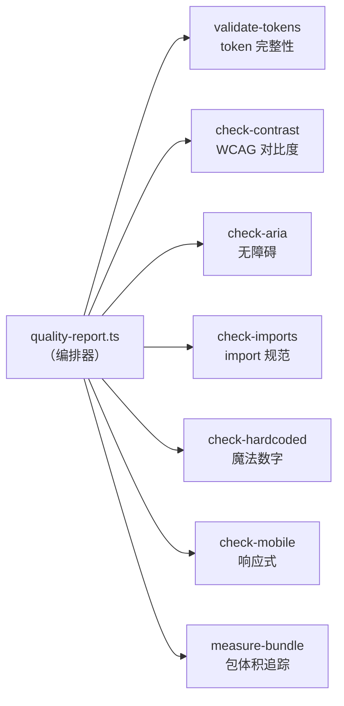
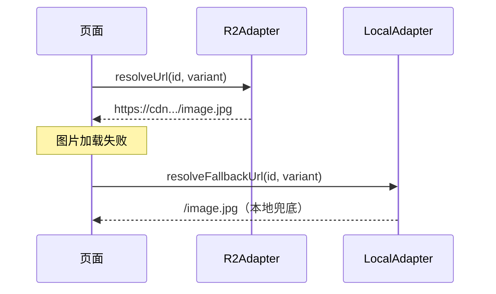
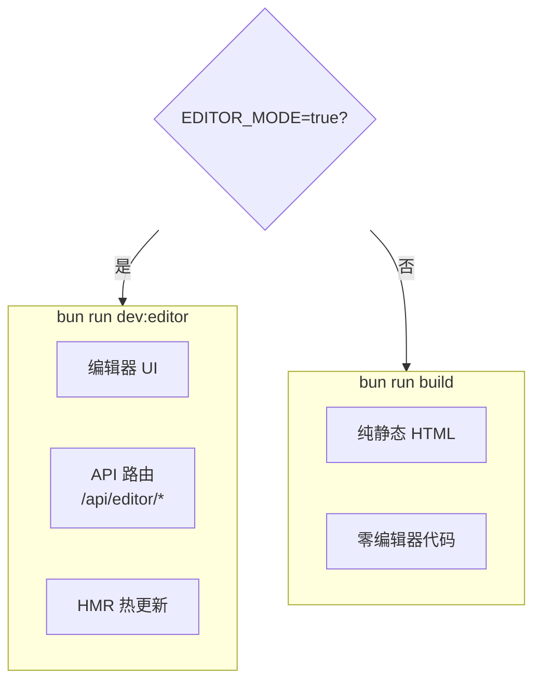
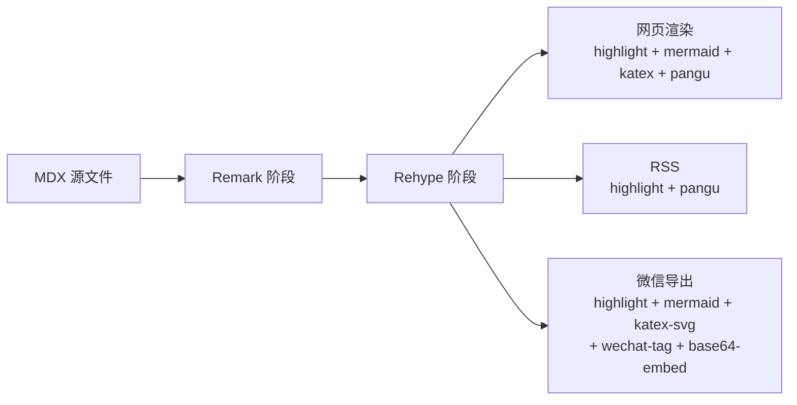

> **TL;DR** — 个人项目防烂的思路：
> 
> 约束前置 → 用 token/schema/接口把规则固化到架构里
> → 自动验证 → 把规范变成 CI 里的可执行检查
> → 抽象隔离 → 让不该出现的代码在物理上不可能出现
> → 按需组合 → 单一职责的模块自由拼装，而不是复制粘贴
> 
> 核心原则：好的架构让错误写法不可能出现，而不是出现后靠测试兜底。

### 个人项目的宿命

个人博客有个很经典的死法：写了三个月，改了两个月，然后再也不想碰了。

为啥？因为代码烂了。一开始随便写写，颜色硬编码、样式到处散、组件之间互相耦合。等你想加个暗色模式，发现要改 47 个文件；想换个 CDN，发现 URL 写死在 15 个组件里；想让别人帮忙写篇文章，发现他得先理解你的整个项目结构。

::sticker[v2_cf77560f-c19f-41ae-84e9-9e580bf131dl.gif]::

这篇文章聊聊我在做这个博客的过程中，踩了哪些坑，最后沉淀出了哪些架构模式。不是什么高深的东西，但确实让一个人维护的项目也能保持不烂。

其实这些思路不是做博客时才想到的。之前做 [uinspy](https://github.com/W-Mai/uinspy)（一个 LVGL 运行时可视化工具）的时候，就已经在实践了——[从零造编译时 UI 框架](/blog/uinspy-compile-time-ui-framework)、[编译时 CSS 自动 Scope](/blog/css-auto-scope)、[模块化 Dashboard 重构](/blog/uinspy-modular-dashboard)，每一步都是在用架构手段消除问题，而不是靠测试兜底。博客只是把这套思路又验证了一遍。

### Design Token：让「用错颜色」变成不可能

第一个要解决的问题是样式混乱。

新拟态（Neumorphism）风格对颜色和阴影的一致性要求很高。一个卡片的阴影方向错了、一个按钮的颜色深了一点，整个页面的视觉就崩了。靠人眼盯？一个人的项目，你就是唯一的 reviewer，盯不住的。:sticker[getimgdata-10.jpg]:

解法是 design token。所有颜色、阴影、圆角、间距都定义成 CSS 自定义属性，组件只能引用 token，不能直接写值：

```css
/* tokens.css — 唯一的颜色来源 */
:root {
  --color-bg: #e8ecf1;
  --color-surface: #e0e5ec;
  --color-txt: #2d3748;
  --shadow-neu-flat: 6px 6px 12px #c5cad1, -6px -6px 12px #ffffff;
  /* ... */
}

.dark {
  --color-bg: #2d3142;
  --color-surface: #353a50;
  --color-txt: #e2e8f0;
  --shadow-neu-flat: 6px 6px 12px #252838, -6px -6px 12px #353a4c;
}
```

```css
/* neumorphism.css — 只引用 token */
.neu-card {
  background: var(--color-surface);
  color: var(--color-txt);
  box-shadow: var(--shadow-neu-flat);
}
```

这样做的好处不只是「好维护」。关键在于：**你可以用脚本验证 token 的完整性。**


### 质量脚本：把规范变成代码

我写了一组脚本，在 CI 里自动跑：

- `validate-tokens.ts`：检查每个 token 在 `:root` 和 `.dark` 里都有定义，缺一个就报错
- `validate-token-usage.ts`：扫描所有 CSS/TSX 文件，找出定义了但没被引用的 token
- `check-contrast.ts`：解析 token 值，计算前景/背景的 WCAG 对比度，不达标就报错
- `check-aria.ts`：扫描所有交互元素，检查是否有 `aria-label` 或可访问文本
- `check-imports.ts`：验证 import 路径是否遵循 `~/` 别名约定
- `check-hardcoded.ts`：找出硬编码的颜色值、字体大小等魔法数字



这套东西的核心思想是：**规范不应该是文档里的一句话，而应该是 CI 里的一个检查。** 文档会过时，人会忘记，但脚本不会。新人（包括 AI）来了，不需要读完所有文档就能写出符合规范的代码——写错了 CI 会告诉你。:sticker[v2_833ed88f-8315-4a5d-aced-dd9512438acl.gif]:

### 内容与代码分离：泛型 YAML 加载器

博客不只有文章。还有想法（thoughts）、友链（friends）、心愿（wishes）、画廊（gallery）。每种内容都是 YAML 文件，结构不同，但加载逻辑是一样的：读目录 → 解析 YAML → 校验 schema → 返回类型安全的数组。

所以我写了一个泛型加载器：

```typescript
function loadYamlCollection<T>(dir: string, schema: ZodSchema<T>): T[]
```

每种内容类型只需要定义 Zod schema：

```typescript
// schemas.ts — 所有内容类型的 schema 集中在这里
export const thoughtSchema = z.object({
  content: z.string().min(1),
  createdAt: z.string().refine(s => !isNaN(Date.parse(s))),
  tags: z.array(z.string()).optional(),
  mood: z.string().optional(),
});

export const friendSchema = z.object({
  name: z.string().min(1),
  url: z.string().default('#'),
  avatar: z.string().default(''),
  description: z.string().default(''),
});
```

然后一行代码加载：

```typescript
export const loadThoughts = () => loadYamlCollection('thoughts', thoughtSchema);
export const loadFriends  = () => loadYamlCollection('friends', friendSchema);
```

想加一种新的内容类型？三步：
1. 在 `schemas.ts` 定义 schema
2. 在对应目录放 YAML 文件
3. 写一个页面渲染它

不需要改加载逻辑，不需要改构建配置。schema 就是文档，Zod 的错误信息就是校验反馈。

::sticker[getimgdata-7.gif]::


### CDN 抽象：换供应商不改代码

图片托管是个典型的「一开始随便写，后面改不动」的问题。把 Cloudflare R2 的 URL 写死在组件里，哪天想换 S3 或者 OSS，你就得全局搜索替换，还得祈祷没漏掉。

解法是策略模式。定义一个接口，让业务代码只依赖接口：

```typescript
interface CdnAdapter {
  readonly name: string;
  resolveUrl(imageId: string, variant?: string): string;
}
```

两个实现：

```typescript
class R2Adapter implements CdnAdapter {
  resolveUrl(imageId, variant) {
    return `${this.endpoint}/${this.bucket}/${imageId}/${variant}`;
  }
}

class LocalAdapter implements CdnAdapter {
  resolveUrl(imageId, variant) {
    return `/${imageId}/${variant}`;
  }
}
```

通过环境变量选择用哪个：

```typescript
function createAdapter(): CdnAdapter {
  const endpoint = import.meta.env.CDN_ENDPOINT;
  const bucket = import.meta.env.CDN_BUCKET;
  if (endpoint && bucket) return new R2Adapter({ endpoint, bucket });
  return new LocalAdapter({ basePath: '/' });
}
```

客户端还有 fallback：R2 图片加载失败时，`onerror` 里自动切到 `LocalAdapter` 的 URL。CDN 挂了用户也能看到图片（虽然慢一点）。



换 CDN 供应商？实现一个新的 `CdnAdapter`，改一下环境变量，完事。业务代码一行不动。:sticker[v2_1b816ee1-7f2f-4f92-a2c3-c0330d4c574l.gif]:

### 编辑器隔离：开发爽，生产干净

这个博客有一个内置的在线编辑器：CodeMirror 6 编辑器、实时预览、图片拖拽上传、AI 辅助、Git 提交、微信公众号导出。功能很多，代码量也不小（`Live.tsx` 一个文件就一千多行）。

但这些代码**不应该出现在生产构建里**。用户访问博客的时候不需要编辑器，加载这些代码只会拖慢速度、增大包体积、暴露不必要的 API。

解法是用 Vite dev plugin 做环境隔离：

```typescript
function editorDevIntegration(): AstroIntegration {
  return {
    name: 'editor-dev',
    hooks: {
      'astro:config:setup': ({ config, updateConfig }) => {
        if (process.env.EDITOR_MODE !== 'true') return; // 生产构建直接跳过
        updateConfig({
          vite: { plugins: [editorHmrPlugin()] }
        });
      }
    }
  };
}
```

`editorHmrPlugin` 在 Vite 的 `configureServer` 里注册所有编辑器 API 路由（文章 CRUD、图片上传、AI 聊天、Git 操作等）。这些路由只存在于 dev server，`astro build` 的时候完全不存在。



这样做的好处：
- 开发时有完整的 CMS 体验
- 生产构建零泄漏，包体积不受影响
- 编辑器的 API 不会暴露在公网

### Markdown 管线：一条管线，多个出口

博客的内容处理不只是「Markdown → HTML」。同一篇文章可能需要：
- 渲染成网页（带代码高亮、Mermaid 图表、数学公式）
- 生成 RSS（纯 HTML，不能有自定义组件）
- 导出到微信公众号（图片要内联成 base64，代码块要换样式）

如果每个出口都写一套处理逻辑，维护成本会爆炸。所以我把处理逻辑拆成独立的 rehype/remark 插件，每个插件只做一件事：

| 插件 | 职责 |
|------|------|
| `remark-sticker` | 解析 `:sticker[name]:` 语法 |
| `rehype-pangu` | CJK 和半角字符之间自动加空格 |
| `rehype-code-highlight` | 代码块语法高亮 |
| `rehype-mermaid-svg` | Mermaid 代码块 → SVG |
| `rehype-katex-svg` | 数学公式 → SVG |
| `rehype-wechat-tag` | HTML 标签适配微信编辑器 |
| `rehype-base64-embed` | 图片转 base64 内联 |

不同的出口组合不同的插件：



加一个新的输出目标？组合已有插件就行，不用重写处理逻辑。

### Island 架构：静态为主，交互按需

Astro 的 island 架构是这个博客性能的关键。页面默认是纯静态 HTML，只有需要交互的部分才加载 JavaScript：

- 搜索对话框（`SearchDialog.tsx`）：用户按 `⌘K` 才加载 MiniSearch 引擎
- 评论区（`GiscusClient.tsx`）：滚动到页面底部才加载
- 画廊灯箱（`GalleryLightbox.tsx`）：点击图片才加载
- 文章里的交互演示（`ClippingDemo.tsx` 等）：`client:load` 按需 hydrate

```typescript
// MDX 里嵌入交互组件
import ClippingDemo from './ClippingDemo';

<ClippingDemo client:load />
```

每个 island 独立加载、独立 hydrate，一个组件的 JS 不会影响其他页面。首页没有交互组件？那首页就是零 JS。

### 总结：架构优先于测试

这些模式有一个共同的思路：**用架构手段从根源上消除一类问题，而不是靠测试去逐个覆盖。**

- Token 系统 → 不可能用错颜色（而不是测试每个组件的颜色值）
- 泛型加载器 + Zod schema → 不可能加载出错误结构的数据（而不是测试每个 YAML 文件）
- CDN 接口抽象 → 不可能写死供应商 URL（而不是 grep 检查硬编码）
- 环境隔离 → 不可能泄漏编辑器代码（而不是测试生产包里有没有编辑器）
- 插件化管线 → 不可能重复实现处理逻辑（而不是测试每个出口的输出一致性）

测试当然还是要写的，但测试应该验证「架构约束是否成立」（比如「每个 token 在所有主题下都有定义」），而不是追着每个组件的具体实现写断言。

这套思路在 uinspy 项目里也一样成立：

- [Bun Plugin 编译时模板转换](/blog/bun-plugin-compile-time-template)：用编译器消除运行时模板解析，而不是测试模板渲染是否正确
- [编译时 CSS 自动 Scope](/blog/css-auto-scope)：用 tag name 前缀在构建时隔离样式，而不是测试每个组件的 CSS 有没有泄漏
- [从零造编译时 UI 框架](/blog/uinspy-compile-time-ui-framework)：用类型系统和编译时检查约束组件接口，而不是运行时断言
- [模块化 Dashboard 重构](/blog/uinspy-modular-dashboard)：用 builder 模式和类型约束让错误组合不可能出现
- [渲染器三次重写](/blog/uinspy-renderer-evolution)：每次重写都是在架构层面解决上一版的天花板，而不是在旧架构上打补丁

好的架构让错误写法不可能出现，而不是出现后靠测试兜底。

::sticker[v2_8f1f8006-246a-40d5-9f9d-fb73f64291dl.gif]::
