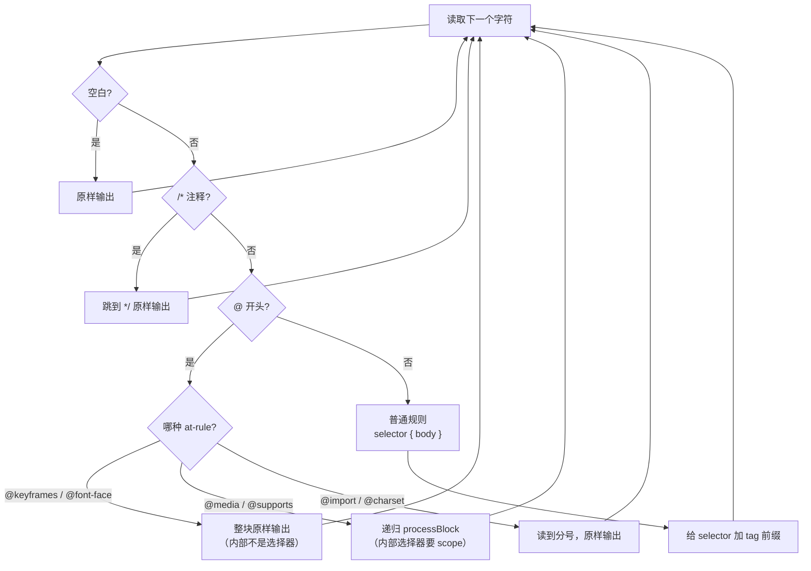

### 问题

Web Components 有个自带的样式隔离方案：Shadow DOM。每个组件的样式天然封闭，外面的 CSS 进不来，里面的也出不去。

听起来很美好，但实际用起来有几个要命的问题：

1. **Tailwind 用不了：** Tailwind 的 utility class 是全局的，Shadow DOM 里面看不到外面的 `<style>`，所以 `@apply flex items-center` 直接失效
2. **全局样式穿不透：** 想给所有组件统一字体、统一 reset？对不起，每个 Shadow DOM 都是一座孤岛
3. **调试体验差：** DevTools 里看到的 DOM 结构多了一层 shadow-root，选择器也变得诡异

::sticker[v2_156e471e-b17c-4fa3-9faf-e2f7489faf2l.gif]::

我在做 [uinspy](https://github.com/W-Mai/uinspy) 的时候，一开始用了 Shadow DOM，写了两个组件就受不了了。组件里想用 Tailwind class，不行；想共享一套 design token，不行；想用 `@apply` 复用样式，更不行。

### 思路：编译时加前缀

既然运行时隔离（Shadow DOM）和 Tailwind 水土不服，那就换个思路：**编译时隔离**。

核心想法很简单：每个组件有一个唯一的 tag name（比如 `ui-topbar`），在构建时把组件的 CSS 选择器全部加上这个 tag name 作为前缀。

```css
/* before: component css */
.toggle { @apply flex items-center w-8 h-8; }
.toggle:hover { @apply border-blue; }

/* after: scoped css */
ui-theme-toggle .toggle { @apply flex items-center w-8 h-8; }
ui-theme-toggle .toggle:hover { @apply border-blue; }
```

因为 Custom Element 的 tag name 在 DOM 里天然存在（`<ui-theme-toggle>` 就是一个真实的 DOM 节点），所以 `ui-theme-toggle .toggle` 只会匹配这个组件内部的 `.toggle`，不会影响其他组件。

零运行时开销，零额外 DOM 结构，Tailwind 正常工作。:sticker[v2_1b816ee1-7f2f-4f92-a2c3-c0330d4c574l.gif]:

### 组件里怎么写

在 `.ui.ts` 文件里，用 `css`` ` tagged template 声明样式（`.ui.ts` 的约定和 Bun plugin 架构见 [Bun Plugin 编译时模板转换](/blog/bun-plugin-compile-time-template)）：

```typescript
//@ component("ui-theme-toggle")
class UiThemeToggle extends BaseComponent {
  static __style = css`
    .theme-toggle {
      @apply flex items-center justify-center w-8 h-8 rounded-lg cursor-pointer;
    }
    .theme-toggle:hover { @apply border-blue text-blue; }
  `;
  // ...
}
```

`css`` ` 不是运行时函数，它只是一个标记，告诉 Bun plugin：「这段 CSS 需要 scope 处理」。构建完成后，`css`` ` 会被替换成空字符串，组件的 `__style` 变成 `""`，样式已经被收集走了。

### scope 算法

第一版很简单，一个正则搞定：

```typescript
function scopeCSS(css: string, tag: string): string {
  return css.replace(
    /([^{}@/]+?)(\{[^}]*\})/g,
    (_, selectors, body) => {
      const scoped = selectors.split(",").map(s => {
        s = s.trim();
        if (!s || s.startsWith("@")) return s;
        if (s === ":host") return tag;
        return `${tag} ${s}`;
      }).join(", ");
      return `${scoped} ${body}`;
    }
  );
}
```

逻辑：找到每个 `selector { body }` 对，给 selector 加上 tag 前缀。`:host` 替换成 tag 本身（兼容从 Shadow DOM 迁移过来的代码）。

::sticker[getimgdata-11.gif]::

但这个正则版有个致命问题：**嵌套的花括号会搞乱匹配。** `@media` 里面的规则、`@keyframes` 的帧定义，都有花括号，正则分不清哪个 `}` 是选择器的结束，哪个是 at-rule 的结束。

### 第二版：递归下降

所以第二版改成了手写的递归下降 parser，核心是 `processBlock` 函数。逐字符扫描 CSS，根据当前字符分流到不同的处理分支：



关键设计：`@media` 这类条件规则会**递归调用** `processBlock`，所以嵌套多深都能正确 scope。而 `@keyframes` 里面的 `from { }` / `to { }` 不是选择器，直接跳过不处理。

花括号匹配用深度计数：遇到 `{` 就 depth++，遇到 `}` 就 depth--，归零时就是匹配的闭合位置。

### 选择器的特殊处理

不是所有选择器都该加前缀，有几个特例：

| 选择器 | 处理方式 | 原因 |
|--------|---------|------|
| `:host` | → `tag` | Shadow DOM 兼容，指代组件自身 |
| `:host(.active)` | → `tag.active` | 同上，带条件 |
| `:root` / `*` | 不变 | 全局选择器 |
| 其他 | → `tag selector` | 默认加前缀 |

`:host` 是 Shadow DOM 里指代组件自身的伪类。迁移到 light DOM 之后，`:host` 就等于组件的 tag name。`:host(.active)` 变成 `ui-topbar.active`，语义完全一致。

### 样式收集 + Tailwind 管线

scope 完的 CSS 不是直接塞回组件里，而是收集到一个全局数组：

```typescript
export const collectedCSS: string[] = [];

// in plugin onLoad:
code = code.replace(styleRe, (_, prefix, cssContent) => {
  collectedCSS.push(scopeCSS(cssContent, tagName));
  return `${prefix}\`\``;  // __style = "" (empty)
});
```

为啥？因为组件的 CSS 里用了 `@apply`，这是 Tailwind 的语法，需要 Tailwind 编译器处理。如果直接把 scoped CSS 留在 JS 里，Tailwind 看不到它。

所以构建流程是这样的：

```
1. Bun plugin 处理 .ui.ts
   ├─ scope CSS → 收集到 collectedCSS[]
   └─ __style = "" (清空)

2. 合并 CSS
   app.css + collectedCSS.join("<br />") → fullCssInput

3. Tailwind 编译
   compile(fullCssInput) → 处理 @apply、@theme、utility classes

4. 内联到 HTML
   <style>${compiledCSS}</style>
   <script>${bundledJS}</script>
```

这样 `@apply flex items-center` 在 scope 之后变成 `ui-topbar .toggle { @apply flex items-center; }`，Tailwind 编译器正常展开，最终产物里是纯 CSS，没有任何运行时。:sticker[v2_8f1f8006-246a-40d5-9f9d-fb73f64291dl.gif]:

### 运行时注入（兜底）

虽然大部分样式走 Tailwind 管线，但 `BaseComponent` 里还保留了一个运行时注入机制：

```typescript
class BaseComponent extends HTMLElement {
  private static __injected = new Set<string>();

  connectedCallback() {
    const tag = this.tagName.toLowerCase();
    if (ctor.__style && !BaseComponent.__injected.has(tag)) {
      BaseComponent.__injected.add(tag);
      const s = document.createElement("style");
      s.textContent = ctor.__style;
      document.head.appendChild(s);
    }
    // ...
  }
}
```

每个组件的样式只注入一次（用 `Set` 去重）。正常构建流程下 `__style` 是空字符串，这段代码不会做任何事。但如果有组件的 CSS 没走 Tailwind 管线（比如纯运行时的样式），它还能兜底。

### 从 Shadow DOM 迁移

迁移其实很简单，就三步：

1. 删掉 `this.attachShadow({ mode: "open" })`
2. `this.root.appendChild(el)` → `this.appendChild(el)`
3. `this.root.querySelector(sel)` → `this.querySelector(sel)`

```typescript
// before: Shadow DOM
class BaseComponent extends HTMLElement {
  protected root: ShadowRoot;
  constructor() {
    super();
    this.root = this.attachShadow({ mode: "open" });
  }
  connectedCallback() {
    // style → shadow root
    this.root.appendChild(styleEl);
    // template → shadow root
    this.root.appendChild(this.el);
  }
}

// after: Light DOM + auto scope
class BaseComponent extends HTMLElement {
  connectedCallback() {
    // style → document.head (once per tag)
    document.head.appendChild(styleEl);
    // template → this (light DOM)
    this.appendChild(this.el);
  }
}
```

组件代码几乎不用改，CSS 选择器也不用改（scope 是自动加的）。唯一要注意的是 `:host` 会被自动替换成 tag name，所以如果之前用了 `:host` 选择器，迁移后行为一致。

### 和其他方案的对比

| 方案 | 隔离方式 | Tailwind | 全局样式 | 运行时开销 |
|------|---------|----------|---------|-----------|
| Shadow DOM | 运行时封装 | ❌ 不可用 | ❌ 穿不透 | 有（shadow tree） |
| CSS Modules | 构建时 hash | ⚠️ 需配置 | ✅ 可共存 | 无 |
| Scoped `<style>` (Vue) | 构建时 `[data-v-xxx]` | ✅ 可用 | ✅ 可共存 | 无 |
| BEM 命名约定 | 人工约定 | ✅ 可用 | ✅ 可共存 | 无 |
| **Tag prefix scope** | 构建时前缀 | ✅ 原生支持 | ✅ 可共存 | 无 |

Tag prefix scope 的优势在于：**不需要额外的 attribute 或 hash，利用 Custom Element 已有的 tag name 做天然的 scope boundary。** 选择器可读性好（`ui-topbar .toggle` 比 `.toggle[data-v-7ba5bd90]` 好读多了），调试的时候一眼就知道这个样式属于哪个组件。

::sticker[getimgdata-8.jpg]::

当然，这个方案有个前提：你得用 Custom Element。如果是普通的 `<div>` 组件，没有唯一的 tag name，这招就不好使了。但如果你本来就在用 Web Components，这基本是没有什么代价的。

### 实际效果

拿 `ui-topbar` 组件举例，它的 CSS 有 `@apply`、`@media`、嵌套选择器、伪类，全部正确 scope：

```css
/* input */
.topbar { @apply sticky top-0 z-50 flex items-center gap-4; }
.topbar-nav a:hover { @apply bg-surface0 text-txt; }
@media (max-width: 768px) { .topbar-nav { @apply hidden; } }

/* output (after scope + Tailwind compile) */
ui-topbar .topbar { position: sticky; top: 0; z-index: 50; display: flex; ... }
ui-topbar .topbar-nav a:hover { background-color: var(--color-surface0); ... }
@media (max-width: 768px) { ui-topbar .topbar-nav { display: none; } }
```

`@media` 里面的选择器也被正确 scope 了，`@keyframes` 里面的帧定义没有被误处理。整个 scope 逻辑不到 80 行代码。

::sticker[v2_b142fbb3-70dc-46ef-a023-6bf352cfc3cl.gif]::
