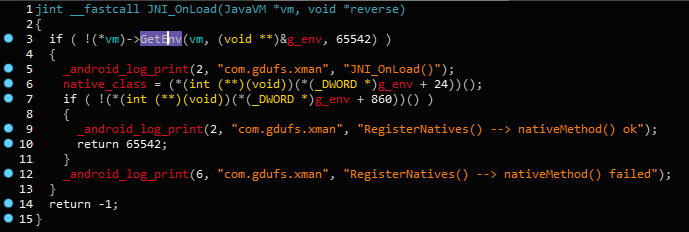
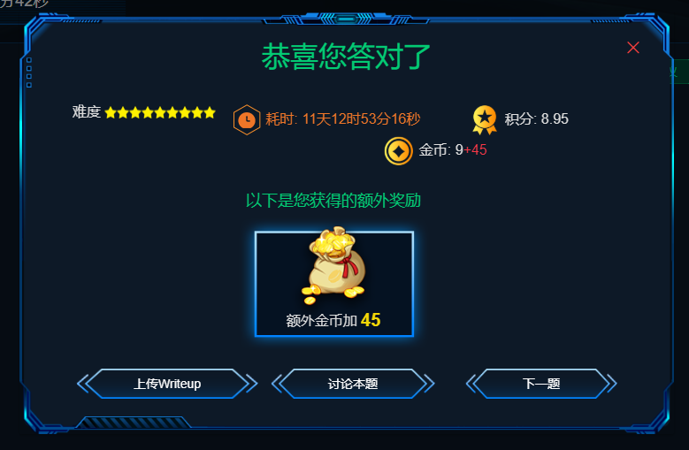

作者：[tuyunlei](https://github.com/tuyunlei)

### 前言

以后打算将解CTF题的过程记录下来
本题链接: [题目传送门](https://adworld.xctf.org.cn/task/answer?type=mobile&number=6&grade=0&id=5095&page=1)

### 解题过程

#### 运行app

1. 下载附件,安装到模拟器,打开可看到一个按钮,点击后提示注册,并输入注册码
2. 输入注册码后提示“您的注册码已被保存”,接着程序自动退出,这和预想的有点儿不太一样

#### 分析Java代码

1. 首先将apk拖进jadx反编译,并导出为gradle项目,方便我用vscode查看代码 (vscode真香)
2. 先检查一遍版本信息之类的有没有hint,因为之前被坑过...然后查看manifest,可以看到注册了一个Application,两个Activity
3. 查看`MyApp`的代码,发现在程序启动时就调用了一个native方法`initSN`,另外还有两个native方法
4. 查看`MainActivity`的代码,首先调用了`MyApp.m`来显示注册状态(顺便搜了一下`MyApp.m`的引用,可以确定这个属性是在native方法里进行修改的),然后注册了`btn1`,点击时会根据`MyApp.m`决定调用`doRegister`,然后再调用native函数`work`
5. 查看`doRegister`方法,跳转到了`RegActivity`,由于不知道`ComponentName`是什么便去Android Developer官网查了一下,原来是用来标识Android四大组件的,不过这里我很好奇代码里的`BuildConfig.APPLICATION_ID`是什么
6. 查看`RegActiivitiy`,调用native函数`saveSN`,保存注册码

#### 分析so库代码

1. 用ApkToolBox反编译apk后,看到库目录里有两个abi:armeabi,armeabi-v7a,由于不太理解这个的区别,便查了一下,这里放个[链接](https://blog.csdn.net/qq_15037231/article/details/51285998),我还特意在ida里对比了一下两个so库的汇编代码的区别,于是发现了arm的汇编指令不是太会...打算有时间再学一下,这里我拿v7a的so库进行分析,这两个so库区别不大
2. 首先找到JNI_OnLoad函数,用IDA修改函数类型为
`jint __fastcall JNI_OnLoad(JavaVM *vm, void *reverse)` 
3. 根据GetEnv的作用将g_env变量设置为JNIEnv*类型,以便于看到结构体对应的函数
4. 在函数调用前的类型转换内右键"强制类型调用",可以显示出当前函数的的参数,可以看到注册了三个native函数
5. 分析`initSN`,若/sdcard/reg.dat内容为"EoPAoY62@ElRD",就把m设置为1,否则0,看到这里我拿着这个字符串去试了一下,然而并不行
6. 分析`work`,根据m值设置不同message,并通过`callWork`调用`MainAcitivty`内`work`方法修改`workString`
7. 分析`saveSN`,发现主要的加密算法放在saveSN里,具体解密思路就不说了,反正也不算太难,解密出来即可拿到flag

ps: 解题时间这么长是因为之前点开这道题但没来得及做

### 学到的

+ armeabi与armabi-v7a的区别
+ ComponentName类,标识Android四大组件

### 要学的

+ arm汇编语法基础
+ BuildConfig用处
