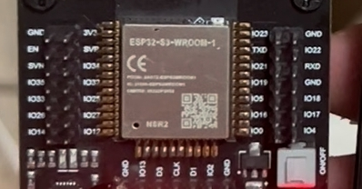

### 一个再简单不过的需求



周末想搞个 ESP32 的蓝牙小灯，先从最小的情景开始：BLE 收到指令就点亮 LED。

手头就有一块**裸的 ESP32 模组**，卡在一块烧录板的弹簧芯片夹里。烧录板上丝印写了「IO4」那个位置，旁边还标了个 LED，看起来就是给你板载 LED 用的，遂我就直接：

```cpp
#define LED_PIN 4
pinMode(LED_PIN, OUTPUT);
digitalWrite(LED_PIN, HIGH);
```

烧进去。串口输出一切正常，BLE 广播也正常。但是**板子上啥反应都没有**。

::sticker[getimgdata-12.jpg]::

### 第一层谎言：它根本不是 ESP32

先别急着怀疑代码。上 esptool 问问芯片自己：

```bash
esptool.py --port /dev/cu.wchusbserial56470145811 flash_id
```

出来的回复看得我手一抖：

```
Detecting chip type... ESP32-S3
Chip is ESP32-S3 (QFN56) (revision v0.2)
Features: WiFi, BLE, Embedded PSRAM 2MB (AP_3v3)
MAC: dc:da:0c:64:6f:34
Detected flash size: 8MB
```

哦豁。:sticker[getimgdata-5.jpg]:

这压根儿就不是普通 ESP32，是 **ESP32-S3**，带 8MB flash、2MB 内置 PSRAM。

好吧，改 `platformio.ini`：

```ini
[env:esp32-s3-devkitc-1]
platform = espressif32
board = esp32-s3-devkitc-1
framework = arduino
```

重新烧完，LED 还是不亮。我也没想硬刚，掏万用表量一下 IO4 看看到底有没有真的输出。黑笔接 GND，红笔戳 IO4：**电压没变化**。顺手也戳了 IO15、IO16，全都没有反应。

当时我只是简单地怀疑「是不是这块烧录板上压根儿就没有给用户用的 LED」，于是决定换个思路，拿外置 WS2812B 接 IO15 来做。没想到更深的坑还在后面。

### 第二层谎言：外接 WS2812B 也不听话

没板载就外接。手头上刚好有一颗 WS2812B，接到烧录板上标着「**IO15**」的那个 pin，VCC 接 5V，GND 共地，DIN 串 330Ω 电阻。教科书配置。

改固件，上 FastLED：

```cpp
#define LED_PIN 15
#define NUM_LEDS 1
CRGB g_leds[NUM_LEDS];

FastLED.addLeds<WS2812B, LED_PIN, GRB>(g_leds, NUM_LEDS);
```

把 BLE 协议扩成四个 characteristic：开关、RGB 颜色、亮度、动画模式。用 Python 脚本从 Mac 上连过去测：

```
[scan]
[connected]
[red]     → write color = (255, 0, 0)
[green]   → write color = (0, 255, 0)
[blue]    → write color = (0, 0, 255)
[breathe yellow]
[rainbow]
[off]
```

脚本跑完，串口输出很完美，每一次 write 都被正确解析：

```
[BLE] write Color <- (255, 0, 0)

  +-------------------------------------+
  |   *** LED  ON  ***                  |
  |   RGB = (255,   0,   0)             |
  |   brightness = 128 / 255            |
  |   mode = solid      (0)           |
  +-------------------------------------+
```

**但是灯何止是不亮，简直就是不亮**。

::sticker[v2_cf77560f-c19f-41ae-84e9-9e580bf131dl.gif]::

### 回到万用表

软件层没问题（串口能复述收到的 RGB），盲猜是物理层有问题了。WS2812 的数据线没工作，要么 MCU 没在输出，要么线断了，要么 pin 接错了。

想起来上一轮我已经量过 IO15 没电压，那时候还只当是个小怀疑。现在刚好顺着这条线追下去：写段更明确的测试代码再量一次。

### 自检固件 v1：只翻转几个 pin

我先假设代码有问题，写了个最干净的自检固件，只做一件事：IO15 每 3 秒翻转一次 HIGH/LOW，同时 IO4/IO5/IO16/IO17/IO18 也一起翻。串口每次翻转都打印。

```cpp
static const int kPins[] = {15, 4, 5, 16, 17, 18};

void loop() {
  static bool hi = false;
  hi = !hi;
  for (int p : kPins) digitalWrite(p, hi ? HIGH : LOW);
  Serial.printf("[%lu ms] output = %s\n", millis(), hi ? "HIGH" : "LOW");
  delay(3000);
}
```

烧进去，万用表戳 IO15。

**还是 100-200mV，没有规律跳变。**

即使我明确地只动这几个 pin，万用表读到的也只是环境噪声，不是真的 HIGH/LOW 波形。

### 自检固件 v2：21 个 pin 同时 10Hz 翻

继续加码，把周期从 3 秒压到 50ms(10Hz)，同时把能安全用的 GPIO 都扫上，除了被 flash/PSRAM/USB/strapping 占掉的那些：

```cpp
static const int kPins[] = {
  1, 2, 3, 4, 5, 6, 7, 8, 9, 10, 11, 12, 13, 14,
  15, 16, 17, 18, 21, 47, 48
};

void loop() {
  static bool hi = false;
  hi = !hi;
  for (int p : kPins) digitalWrite(p, hi ? HIGH : LOW);
  delay(50);
}
```

再戳 IO15。

**读数：1.6V。**

完美符合理论预期：HIGH/LOW 各半，平均 1.65V。感觉胜利在望。:sticker[getimgdata-8.jpg]:

### 但读者比作者聪明

看到读数那一刻，脑海里闪过一句「OK，IO15 在输出，问题锁定在 WS2812 那一侧了」。

然后我自己停下来想了想：**等一下**。

v1 只翻 6 个 pin 的时候，IO15 读不到电压。
v2 把 21 个 pin 一起翻，IO15 读到了 1.6V。

**这两件事合起来有个非常扎心的解释：v2 读到的 1.6V，可能不是 IO15 自己在输出，而是隔壁 pin 串扰过来的。**

21 个 GPIO 同步在以 10Hz 对 3.3V 挥手，pin 之间几十 pF 的寄生电容，足够把邻居的边沿耦合一大截过来。万用表这种高阻抗探头读到的「平均电压」，完全可以是纯粹的电磁感应。

如果这个猜测是对的，那意味着：**我戳的那根 pin，根本不是我以为的 IO15。**

::sticker[v2_15f69528-c9fb-4749-aca6-a74f840d4bdl.gif]::

### 自检固件 v3：逐个点名

验证很简单：一次只翻一个 pin，其他 pin 全部拉成 LOW(OUTPUT + `digitalWrite(LOW)`)，让它们之间没有电平差，也就没了串扰。每个 pin 翻 8 秒，串口醒目地打印当前轮到谁。

```cpp
void loop() {
  for (int active : kPins) {
    Serial.printf("========================================\n");
    Serial.printf("  ACTIVE PIN  ===>  IO%d\n", active);
    Serial.printf("========================================\n");

    uint32_t end = millis() + 8000;
    bool hi = false;
    while (millis() < end) {
      hi = !hi;
      digitalWrite(active, hi ? HIGH : LOW);
      delay(50);
    }
    digitalWrite(active, LOW);  // 切下一个之前拉回 LOW
  }
}
```

烧进去，万用表戳在我**物理上接了 WS2812 的那根 pin 不动**，黑笔在 GND。一眼盯着万用表，一眼盯着串口。

串口轮到 IO1，万用表 0。
IO2，0。
IO3，0。
IO4，0。
IO5、IO6……全是 0。
IO14、IO15，**还是 0**。

IO15 真的不是 IO15。:sticker[getimgdata-16.jpg]:

继续。

IO16、IO17、IO18、IO21 全是 0。
轮到 **IO47** 的那一刻，万用表直接跳到 **1.6V**。

### 真相大白

烧录板上丝印标的「IO15」，**物理上连到芯片的 IO47**。

烧录板的设计者不知道是怎么想的，可能是重排了引脚方便走线，也可能纯粹就是丝印印错了没修。反正这个差值不是小数，是**差了 32 个 GPIO 编号**。

改固件的 `LED_PIN` 到 47，烧进去，Python 脚本再跑一遍：

> 红 → 绿 → 蓝 → 暗 → 黄色呼吸 → 彩虹流水 → 关

灯按部就班地演完了整套。:sticker[v2_833ed88f-8315-4a5d-aced-dd9512438acl.gif]:

### 复盘一下

- **第三方烧录板/底座的丝印不能信**，尤其是小作坊改过的。直接逐个点名比看资料快
- **多 pin 扫描会串扰**。同步翻转的 pin 之间有寄生电容耦合，邻居 pin 上能感应出几百毫伏。要量某一个 pin，其他 pin 都拉到 LOW
- **万用表读方波得到的是平均电压**，不是「这一刻是这么多」。读到 1.6V 的含义是「高电平占空比 × 3.3V」。所以方波周期要短，让表头的稳定时间能覆盖到多个周期
- **排查从软件往硬件走**：串口 → esptool → 自检固件 → 万用表。每一步都在缩小假设空间

### 自检固件模板

```cpp
// ESP32-S3 pin-map verifier
// 逐个 pin 翻转 8 秒,其他 pin 保持 LOW,阻断串扰
#include <Arduino.h>

// 按需修改:目标 GPIO 白名单
static const int kPins[] = {
  1, 2, 3, 4, 5, 6, 7, 8, 9, 10, 11, 12, 13, 14,
  15, 16, 17, 18, 21, 47, 48
};

void setup() {
  Serial.begin(115200);
  for (int p : kPins) {
    pinMode(p, OUTPUT);
    digitalWrite(p, LOW);
  }
}

void loop() {
  for (int active : kPins) {
    Serial.printf("\n>>> ACTIVE: IO%d (others LOW)\n", active);
    uint32_t end = millis() + 8000;
    bool hi = false;
    while (millis() < end) {
      hi = !hi;
      digitalWrite(active, hi ? HIGH : LOW);
      delay(50);
    }
    digitalWrite(active, LOW);
  }
}
```

用法：烧到板子里面，用万用表戳**物理上接线的那个位置**，看串口输出，显示哪个 IO 的时候万用表开始跳。跳的那一刻输出的编号，就是这个物理位置的真实 GPIO。

万用表不会骗人（或许

这种事情，你找谁说理去啊。

::sticker[getimgdata-5.jpg]::
