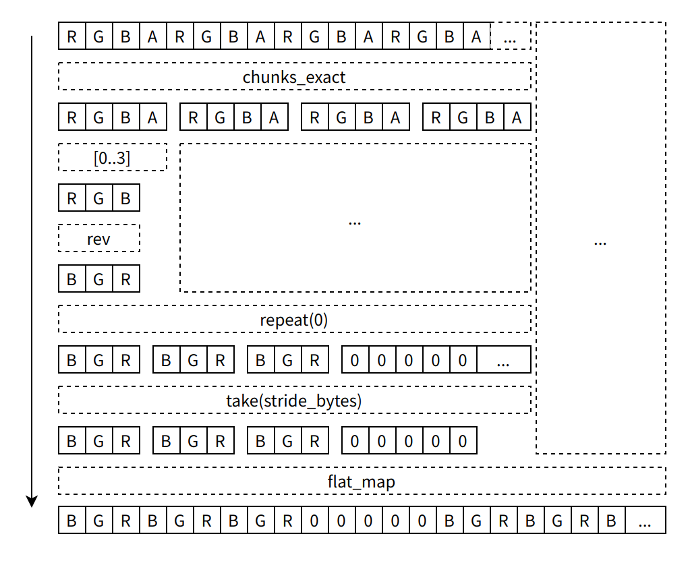

## 函数式编程与命令式编程

**函数式编程：**

- 关注点：数据不可变性、纯函数和函数组合。
- 特点：函数是第一等公民，意味着函数可以像其他数据类型一样被传递和操作。
- 目的：通过避免副作用和状态改变来提高代码的可维护性和可读性。

```rust
list.map(value => value + 1).take(3)
```

**命令式编程：**

- 关注点：状态和操作，通常使用变量和循环。
- 特点：程序是由一系列的命令组成，描述如何执行操作。
- 目的：更直接地控制计算机的状态和行为。

```rust
let result = []
let count = 0
for value in list {
    count++
    result.append(value + 1)
    if count == 3 {
        break
    }
}
```

函数式编程更注重数据和操作的组合，而命令式编程更注重如何执行操作和管理状态。

## 什么是迭代器

迭代器模式允许你对一个序列的项进行某些处理。迭代器（iterator）负责遍历序列中的每一项和决定序列何时结束的逻辑。当使用迭代器时，我们无需重新实现这些逻辑。

迭代器的操作一般都是惰性的，直到需要取出迭代器中的值之前，迭代器中的值都不参与运算。

## 迭代器的核心方法

迭代器常用的方法有：`next`、`map`、`flat_map`、`filter`、`filter_map`、`fold`、`take`、`rev`、`cycle`、`skip`、`repeat`、`chain` 等等。

这些方法通常都是施加在一个迭代器上面，并逐个处理迭代器中的每一个元素，例如：

```rust
let a = [1, 2, 3]
a.iter().map(xxxxxxx)
```

### next

迭代器产生一次运算，并从中获取一个值，一般情况下，如果迭代器达到最后一个元素后，再次调用 `next` 方法会得到空或者异常，这取决使用的是什么编程语言。例如：

```rust
let a = [1, 2, 3]
let it = a.iter()
print(it.next())
print(it.next())
print(it.next())
print(it.next())
```

将会得到如下的结果：

```
1
2
3
None
```

以下的所有示例中的结果中的每个元素都等同于在迭代器上调用了 `next` 方法。

### map

映射，如其名，将迭代器中的每一个元素映射成为另一个元素，包括类型的转变。例如：

```rust
let a = [1, 2, 3]
a.iter().map(
    value => return value.to_string()
)
```

那么就会得到一个从整数转变为字符串构成的列表：

```rust
["1", "2", "3"]
```

### flat_map

从名字可以看出，扁平化映射。有时候我们每次迭代运算得到的数据可能是一个新的可迭代对象，如数组。这个时候，`flat_map` 就可以将每次迭代产生的可迭代对象压平收集在一起。例如：

```rust
let a = ["hello", "world", "!"]
a.iter().flat_map(
    value => {
        value.iter()
    }
)
```

那么就会得到一个被拆散的字符数组：

```rust
['h', 'e', 'l', 'l', 'o', 'w', 'o', 'r', 'l', 'd', '!']
```

### filter

过滤器或者是滤波器，在其他地方有这样的叫法。在这里也一样，`filter` 接受一个返回 `bool` 类型的闭包（回调函数），`filter` 的结果会跳过所有不满足条件的值。例如：

```rust
let a = [1, 2, 3, 4]
a.iter().filter(
    value => value.is_odd()
)
```

可以得到一个这样的结果：

```rust
[1, 3]
```

### fold

折叠，有些地方叫 `reduce`，它的主要作用是将迭代器中的每一个元素和前一个元素相互作用，并作为下一个元素的前一个元素来处理。例如：

```rust
let a = [1, 2, 3]
a.iter().fold(0,
    (acc, value) => acc + value
)
```

这样其实就得到了一个累加的结果，如果换做是乘法，就可以得到一个累乘的结果。

```
0 + 1 = 1
1 + 2 = 3
3 + 3 = 6
```

### take

拿走，拿走几个。这个方法非常的直白，就是 take n 个元素，例如：

```rust
let a = [1, 2, 3]
a.iter().take(1)
```

就会得到如下结果：

```rust
[1]
```

### 再介绍几个

- `rev`：反转
- `cycle`：首尾相接，变成一个环
- `skip`：跳过几个
- `repeat`：无限重复某元素
- `chain`：拼接迭代器
- `chunks_exact`：产生一个 n 个元素一组的迭代器

## 如何使用？

迭代器方法的返回值也是一个迭代器，这样就可以把所有的迭代器串起来使用。

理论可行，实践开始！

### 实践 1

如何实现一个将 RGBA 颜色的一维数组转换为 BGR 颜色的一维数组并支持按字节的 stride？

```rust
data
    .chunks_exact(width_bytes)
    .flat_map(|row| {
        row.chunks_exact(color_bytes)
            .flat_map(|chunk| chunk[0..3].iter().rev().copied())
            .chain(std::iter::repeat(0))
            .take(stride_bytes)
    })
    .collect()
```



### 实践 2

如何实现一个将 A1～8 颜色的带有按字节 stride 的一维数组转换为 RGBA 颜色的一维数组？

```rust
let bpp = color_format.get_bpp() as u8;
let alpha_iter = data
    .chunks_exact(stride_bytes)
    .flat_map(|row| {
        row.iter()
            .flat_map(|alpha|
                (0u8..8u8 / bpp).flat_map(move |i| {
                    iter::repeat(0).take(3).chain(iter::once(
                        (alpha >> ((8 / bpp - 1 - i) * bpp)) << (8 - bpp),
                    ))
                })
            )
            .take((width * ColorFormat::ARGB8888.get_size() as u32) as usize)
    });
alpha_iter.collect()
```

## 参考文献

颜色转换代码来自：[icu](https://github.com/w-mai/icu)
