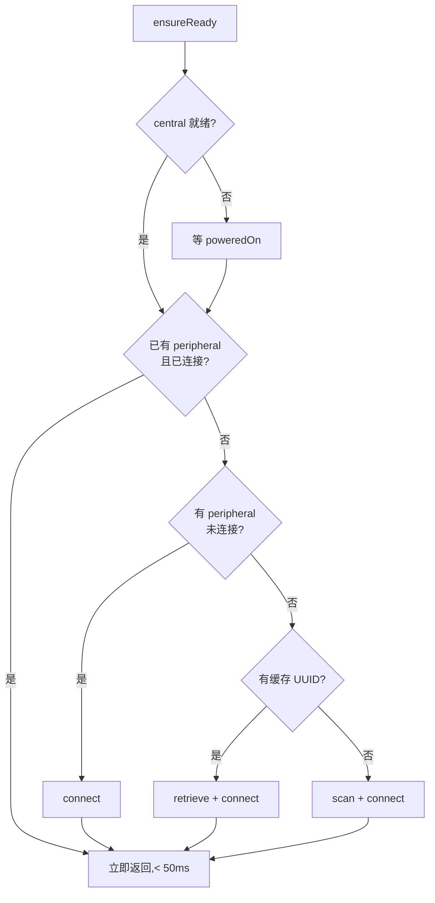

### 最小需求

目标很朴素：

1. iPhone 对 Siri 说一句话
2. ESP32 上的 WS2812 灯立刻变色或切换
3. **app 不需要打开在前台**，整个过程用户对 app 无感知

手写过 BLE 客户端的都知道，CoreBluetooth 的 API 本身不复杂，写完一遍脑子里就有完整的路径了。真正麻烦的是「**app 不在前台**」这个约束，它把简单的扫描-连接-读写路径拉出了一堆岔口。

BLE 主体代码加起来大约 120 行，搞后台保活和快速响应的辅助代码有 180 行。

### CoreBluetooth 基本路径

先看没有后台约束的最小版本。按 CoreBluetooth 的玩法，一次完整的 BLE 交互是一条单向链：


每一步都是 delegate 回调式的，Apple 给的 API 完全是面向 Objective-C 那一代的设计。你要连个设备写个值，代码会被切成一堆方法，状态散落在类成员里。

用 Swift 写起来第一件事就是**用 async/await 把 delegate 包起来**。每个需要等回调的动作都对应一个 `CheckedContinuation`：

```swift
private var connectCont: CheckedContinuation<Void, Error>?
private var writeConts: [CBUUID: CheckedContinuation<Void, Error>] = [:]

private func connect(_ p: CBPeripheral, timeout: TimeInterval) async throws {
    if p.state == .connected { return }
    try await withCheckedThrowingContinuation { cont in
        self.connectCont = cont
        self.central.connect(p, options: nil)
        // 超时兜底
        Task {
            try? await Task.sleep(nanoseconds: UInt64(timeout * 1e9))
            if let c = self.connectCont {
                self.central.cancelPeripheralConnection(p)
                self.connectCont = nil
                c.resume(throwing: BLEError.connectTimeout)
            }
        }
    }
}

func centralManager(_ central: CBCentralManager, didConnect peripheral: CBPeripheral) {
    Task { @MainActor in
        if let c = self.connectCont {
            self.connectCont = nil
            c.resume()
        }
    }
}
```

上层就能这么写了：

```swift
try await central.scan(timeout: 10)
try await central.connect(peripheral, timeout: 6)
try await peripheral.discover(serviceUUID)
try await peripheral.write(Data([0x01]), for: ledChar)
```

读起来跟同步代码一样，但底层还是异步 delegate。痛一次，爽一辈子:sticker[getimgdata-7.jpg]:

### 接下来麻烦的事情：app 不在前台

App Intents 的 `perform()` 函数是在 app 进程里执行的，但是执行时 app **不一定在前台**。具体来说 iOS 会有三种状态：

1. **前台**：用户主动打开了 app
2. **后台运行**：app 刚用过还没被系统回收，进程还在
3. **被杀**：app 已经被系统或用户清理掉了，不存在进程

Siri 触发 App Intent 的时候，会根据情况选择在哪一种状态下执行。如果是第一次触发，**很可能 app 是被杀的状态，系统会临时启动 app 进程、跑 `perform()`、完了再回收**，整个过程用户屏幕上看不到 app 的任何 UI。

这带来两个非常现实的问题：

**问题一**：蓝牙授权弹窗必须在前台弹出。如果用户从来没打开过 app，CBCentralManager 一初始化就触发权限请求，但 Intent 后台进程没有 UI，弹窗根本不会显示，`perform()` 就挂在那里直到超时。

**问题二**：每次 Intent 执行都是冷启动，一次完整的 scan → connect → discover services → discover chars 走下来 2~4 秒。Siri 说完「皮卡灯用放电」，等 3 秒灯才亮，体验直接拉胯。

### 优化一：缓存 peripheral UUID，跳过 scan

第一次连接到某个设备时，peripheral 对象的 `identifier`（一个 UUID）在本机上是稳定的。把它存到 UserDefaults，下次直接用 `retrievePeripherals(withIdentifiers:)` 问系统要回 peripheral 对象，绕开 scan 这一步：

```swift
private let kLastPeripheralKey = "LEDControl.lastPeripheralUUID"

private func saveCachedPeripheral(_ p: CBPeripheral) {
    UserDefaults.standard.set(p.identifier.uuidString, forKey: kLastPeripheralKey)
}

private func retrieveCachedPeripheral() -> CBPeripheral? {
    guard let s = UserDefaults.standard.string(forKey: kLastPeripheralKey),
          let uuid = UUID(uuidString: s) else { return nil }
    return central.retrievePeripherals(withIdentifiers: [uuid]).first
}
```

有缓存的时候：

```swift
if let p = retrieveCachedPeripheral() {
    self.peripheral = p
    p.delegate = self
    try await connect(p, timeout: 6)
    // 直接进 discover 服务
} else {
    // 没缓存才去 scan
    let p = try await scanForDevice(timeout: 10)
    saveCachedPeripheral(p)
    // ...
}
```

`retrievePeripherals` 是即时返回的，省掉了 scan 的 1~3 秒。单这一项就能把 Siri 说完话到灯亮的延迟从 3 秒压到 1 秒出头。

### 优化二：State Preservation & Restoration

CoreBluetooth 里这个 feature 名字看着平平无奇，第一次读文档可能直接划过去。但放到「app 不在前台」这个场景下，它就刚刚好。

`CBCentralManager` 初始化的时候可以传一个 `restoreIdentifier`：

```swift
self.central = CBCentralManager(
    delegate: self,
    queue: .main,
    options: [
        CBCentralManagerOptionShowPowerAlertKey: true,
        CBCentralManagerOptionRestoreIdentifierKey: "com.w-mai.ledcontrol.central",
    ]
)
```

这个 id 一旦被系统登记，意味着**即使 app 进程被系统回收了，系统内核层面会继续维持这个 central manager 发起的 connect 请求**。

一旦有蓝牙事件发生（设备广播出现、之前 connect 的设备连上了、notify 数据到了），**系统会自动重新拉起 app 到后台**，调用 `willRestoreState` 方法把之前挂起的 peripheral 交回来：

```swift
func centralManager(_ central: CBCentralManager,
                    willRestoreState dict: [String: Any]) {
    guard let restored = dict[CBCentralManagerRestoredStatePeripheralsKey] as? [CBPeripheral],
          let p = restored.first else { return }
    self.peripheral = p
    p.delegate = self
    if p.state == .connected {
        // 连接已经活着，直接续上
        self.isConnected = true
    } else {
        // 还在连，等 didConnect
    }
}
```

要让这件事真的工作，Info.plist 里必须声明后台蓝牙权限：

```xml
<key>UIBackgroundModes</key>
<array>
    <string>bluetooth-central</string>
</array>
```

没这一项，`restoreIdentifier` 就是个摆设，系统不会替你保留状态。

### 优化三：断开后让内核代为重连

常规写法，peripheral 断开之后，app 里会收到 `didDisconnectPeripheral`。一般会在这里做个「断开了」的 UI 提示就完事。但是有个小技巧：**立刻再发一次 `central.connect(peripheral, options: nil)`**。

```swift
func centralManager(_ central: CBCentralManager,
                    didDisconnectPeripheral peripheral: CBPeripheral,
                    error: Error?) {
    Task { @MainActor in
        self.isConnected = false
        // 尝试重连。connect 没有超时就是无限重试,
        // 即使 app 进入后台,系统内核也会替我们继续这件事
        if UserDefaults.standard.string(forKey: kLastPeripheralKey) != nil {
            central.connect(peripheral, options: nil)
        }
    }
}
```

这里 `central.connect` 不传 timeout option，它会无限重试。**即使 app 被挂起，这个 connect 请求会被内核接管下去**。等设备重新出现、可连接了，connect 会在后台悄悄成功，然后 `willRestoreState` 或者 `didConnect` 会把 app 唤醒。

实际的效果是：**很多时候用户喊 Siri 的那一刻，连接其实已经在线了**，`ensureReady` 立刻返回，一句话就能生效。

### 三级快通道：ensureReady 的最终形态

把上面三件事组合起来，ensureReady 的逻辑变成了三级 fallback：



日常场景里，90% 的调用会走上面两条快路径，延迟 500ms 以内。只有冷启动或者开发板第一次配对走 scan 的慢路径。

### 代码量对比

一切写完之后回头数了下代码行数，有点戏剧性的结果：

- BLE 基础操作（ensure、scan、connect、discover、read、write）：**约 120 行**
- 后台保活相关（restoreIdentifier 初始化、willRestoreState 处理、UUID 缓存、重连逻辑、continuation 分片管理）：**约 180 行**

写 BLE 主体写了 1 小时，写保活和快通道耗掉了一个下午。iOS 这套后台模型的学习成本基本都花在**搞清楚系统什么时候会唤醒你、什么时候会回收你、回收前你要把什么状态存到哪里**上面。

::sticker[getimgdata-7.jpg]::

### 一些必须手动处理的细节

- **CBCentralManager 的状态要等 `didUpdateState` 回调才可用**：init 之后直接调 scan 会 no-op，且不会报错，是那种最蛋疼的「写了代码但什么都没发生」的 bug
- **写并发 continuation 要按 characteristic UUID 分片**：如果同时写多个 characteristic（例如「同时改颜色 + 切模式」），单个 `writeCont` 会被第二次写覆盖掉前一个，导致第一个 await 永远不返回。`[CBUUID: CheckedContinuation]` 这样分片存
- **权限第一次必须在前台请求**：这件事 Apple 文档里藏得挺深，但实践是检验真理的唯一标准。所以首次用 app 之前必须让用户打开一次，弹出「小灯泡想使用蓝牙」这个系统弹窗、允许，之后 Intent 才能在后台跑起来
- **ConnectPeripheralOptions 里有个 `CBConnectPeripheralOptionNotifyOnConnectionKey`**：开启之后 app 即使在后台/挂起，也会收到连接状态变化的本地通知。对调试很有帮助

### 效果

改完之后的真实体验：

- **app 已经运行过一次**：喊 Siri，回答之前灯已经亮了，延迟 < 300ms
- **app 在后台刚被回收**：喊 Siri，延迟约 500ms，灯亮
- **app 从未打开过**：Siri 会提示「需要先打开 app 授权蓝牙」

前两种场景在日常用下来占了 95%+。真正的冷启动只在装完 app 之后第一次碰到，之后不会再碰到。

这就是苹果给第三方开发者在后台 BLE 上留的口子。没有完整的 7x24 常驻，但是配合 State Restoration 做到了接近前台的体验，代价是代码量翻倍。

::sticker[v2_833ed88f-8315-4a5d-aced-dd9512438acl.gif]::
