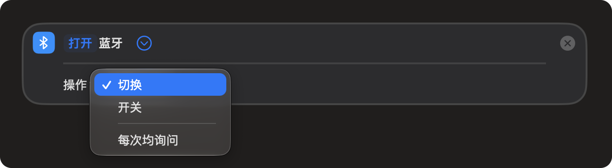
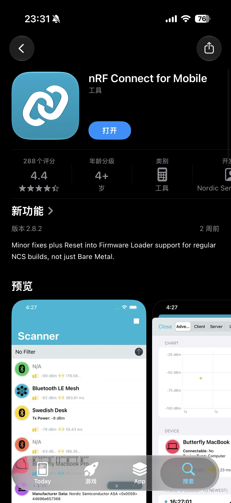

### 一个看起来应该能做的需求

手头上有一个自己搞的 ESP32 小灯，跑了个 BLE GATT server，4 个 characteristic 控开关、颜色、亮度、模式。

Mac 上用 Python 的 `bleak` 写了几行，一路跑通。到 iPhone 这边我的想法是：

> 不写 app，直接用「快捷指令」触发就行。反正苹果自家的 Shortcuts 能干的事情这么多，操作一下蓝牙 characteristic 总不会多难吧？

**然后我就去打开快捷指令，看它的蓝牙动作有啥。**

### 翻一遍能用的就三条

苹果快捷指令里搜「蓝牙」，能用的只有：

**设置蓝牙** — 打开或关闭系统蓝牙

**GATT 读写呢？翻烂了也没有。**

iPhone 自己的 CoreBluetooth framework 啥都齐，App Store 里 BLE 工具一抓一大把。但这一坨能力，快捷指令就是没给你开放。

::sticker[getimgdata-12.jpg]::

好吧，那就找个现成的 app 做桥。

### 借 app 做桥：挨个撞墙

思路很直接：找个能读写 BLE 的 app 当中间层，Shortcuts 通过 URL Scheme 或者 x-callback-url 触发它。

挨个调研一遍：

**nRF Connect for Mobile（Nordic 官方）**

这一类里 BLE 读写功能它最全。问题在于：没有公开的 URL Scheme 能让外部触发一次「连接某设备 → 写某 characteristic」的预设动作。能看能读能写，但你得一直人在 app 里手点，Shortcuts 无法调用。

**LightBlue**

同上，能读能写，但可惜没有可编程的外部入口。

**BLE Scanner 4.0 / BLE Tool / nRFToolbox 这一类**

要么功能受限，要么没有 URL Scheme。这类第三方 BLE 扫描器都是「打开 app 手点」型，自动化触发这事儿没人做。

**Pythonista**

iOS 上能跑 Python 的老牌 app。看起来最有戏：它有 `objc_util` 可以调 Objective-C framework，CoreBluetooth 理论上能用。

实测就翻车了：CBCentralManager 的 delegate 要跨线程回调，`objc_util` 对 delegate protocol 的桥接有限制。能扫到设备，但 connect 回调吃不到，卡死在「connecting」状态。

::sticker[getimgdata-16.jpg]::

**a-Shell（iOS 上的开源终端）**

能跑 Python，开源，有 `pip`。但是 `bleak` 的 macOS/iOS backend 依赖 PyObjC 的 CoreBluetooth 绑定，a-Shell 的 Python 里这一坨是缺的，装不上也跑不起来。

**Safari 的 Web Bluetooth**

iOS Safari **压根儿不支持 Web Bluetooth**。

**Bluefy（第三方 iOS 浏览器）**

唯一给 iOS 带了 Web Bluetooth 的浏览器。可以做一个网页，用 `navigator.bluetooth.requestDevice()` 连设备。但是：

1. 每次请求设备都必须用户点一下授权
2. Shortcuts 能打开一个 URL，但打开之后页面里的 `requestDevice` 还是要人点
3. 相当于把「打开一个 app 手点」换成「打开一个网页手点」

调研到这里大概就死心了。每条看起来有戏的路，最后都要人手点一下。BLE 在 iOS 这边没人给你留口子，一晚上翻下来一手死胡同，挺好的。

::sticker[v2_cf77560f-c19f-41ae-84e9-9e580bf131dl.gif]::

### 认了，自己写 app

**写一个 iOS app，在里面实现 BLE 控制逻辑，然后通过 App Intents 把能力暴露给 Shortcuts。**

iOS 16 之后有了 App Intents 这套东西。自己写个 app，把 BLE 操作包成一个 Intent 的 `perform()`，注册给系统，Shortcuts 就能调，Siri 也能调。代码住在你 app 里，但用户看就是个内置动作。

代价是要过 Xcode 这一关。免费 Apple ID 可以签名装到自己手机上，过 7 天要重签一次；想长期省事，开发者账号 99 刀一年。

给自己玩的小项目，开发者账号是真的贵。临时玩玩，7 天重签一次也能凑合。但你要是想要「Siri 一句话开灯」这种长期能用的东西，钱还是得掏滴。

### 为啥苹果要这样设计

从隐私这边看其实能理解。BLE 扫描能拿到周围设备列表，本身就是一种被动定位；连上去能写值意味着任何路过的 app 都有机会糟蹋你的硬件。锁在 CoreBluetooth 里、套个签名 + 权限弹窗，挺苹果的。

但用户侧看到的就是：想给自己的 ESP32 小玩具加个手机端，Mac 上一行 `bleak.BleakClient` 搞定，iPhone 这边门槛多出几个数量级。

这种事情，你找谁说理去啊。

::sticker[getimgdata-5.jpg]::
