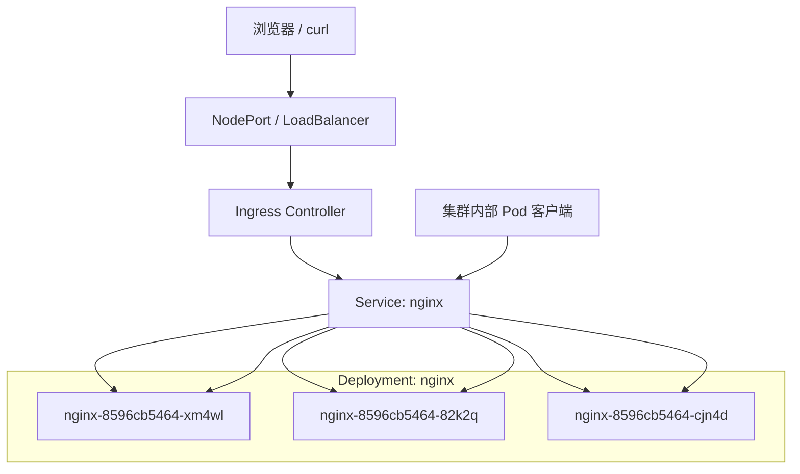

import MultitabPreview from "~/components/MultitabPreview.astro"
import {Fragment} from "astro/jsx-runtime"

# Kubernetes + OrbStack 入门教程

本教程基于 **OrbStack** 本地虚拟化环境，演示从集群查看、Deployment 创建、Service 暴露到 Ingress 配置和流量访问的完整流程。

---

## 1. 查看集群状态

```bash title="查看版本信息"
orb version
docker version
kubectl version --client
````

```bash title="查看节点和 Pod"
kubectl get nodes
kubectl get pods -A
```

> 注意：OrbStack 内部的 Kubernetes 节点是单节点的，所有系统 Pod 初次可能处于 `ContainerCreating` 状态。

---

## 2. 创建 Deployment

```bash title="创建 nginx Deployment"
kubectl create deployment nginx --image=nginx
kubectl get deployment
kubectl get pods -w
```

### 滚动更新

```bash title="更新镜像到 nginx:alpine"
kubectl set image deployment/nginx nginx=nginx:alpine
kubectl get pods -w
```

> 可以看到 Pod 被逐步替换为新镜像，Deployment 保证可用副本数。

---

## 3. 暴露 Service

```bash title="暴露为 NodePort"
kubectl expose deployment nginx --port=80 --type=NodePort
kubectl get svc
```

### 内部与外部访问示例

```bash title="内部访问 ClusterIP"
kubectl run curlpod --rm -i --tty --image=radial/busyboxplus:curl --restart=Never -- curl http://192.168.194.173
```

```bash title="外部访问 NodePort"
curl http://localhost:31021
```

---

## 4. 流量示意图



> 上图展示了**外部访问**和**集群内部访问**的流量路径，Service 自动负载均衡请求到 Pod。

---

## 5. 配置 Ingress

```bash title="安装 ingress-nginx"
kubectl apply -f https://raw.githubusercontent.com/kubernetes/ingress-nginx/controller-v1.9.1/deploy/static/provider/cloud/deploy.yaml
kubectl get pods -n ingress-nginx
```

```bash title="创建 Ingress 规则"
kubectl apply -f nginx-ingress.yaml
kubectl get ingress
```

### 外部访问示例

```bash title="访问 nginx Ingress"
curl -H "Host: nginx.local" http://localhost:32683
```

> 输出：```bashHello from nginx-8596cb5464-82k2q```

---

## 6. 多标签命令与输出展示

<MultitabPreview labels={{tab0: "查看 Pods", tab1: "查看 Services", tab2: "Ingress 访问", preview: "输出"}}>

    <Fragment slot="tab0">
        ```bash title="Pods"
        kubectl get pods -A
        ```
    </Fragment>

    <Fragment slot="tab1">
        ```bash title="Services"
        kubectl get svc
        ```
    </Fragment>

    <Fragment slot="tab2">
        ```bash title="Ingress 测试"
        curl -H "Host: nginx.local" http://localhost:32683
        ```
    </Fragment>

    <Fragment slot="preview">
        ```bash title="Output"
        nginx-8596cb5464-xm4wl
        nginx-8596cb5464-82k2q
        nginx-8596cb5464-cjn4d
        ```
    </Fragment>

</MultitabPreview>

---

## 总结

* 使用 **OrbStack** 可以快速启动本地 Kubernetes 单节点环境
* Deployment + Service + NodePort + Ingress 可以完整模拟生产环境流量
* Service 自动负载均衡请求到 Pod
* Deployment 支持滚动更新，实现平滑升级
