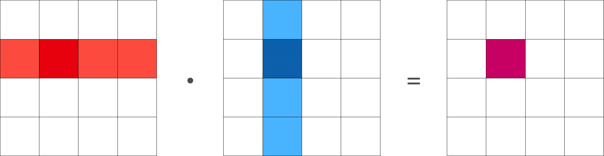
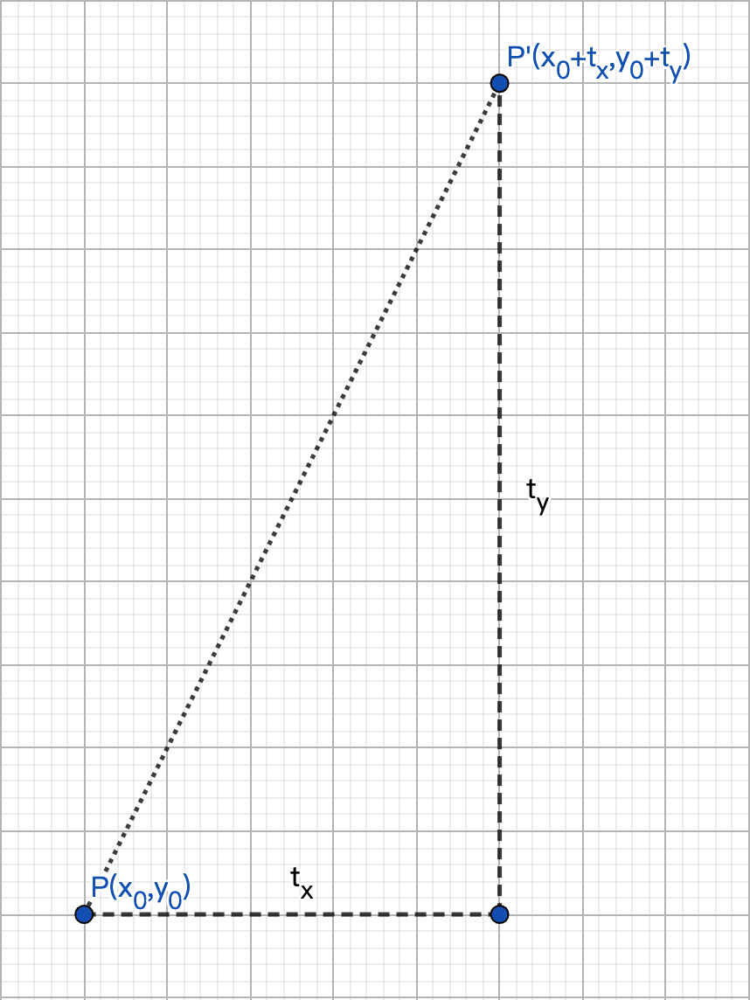
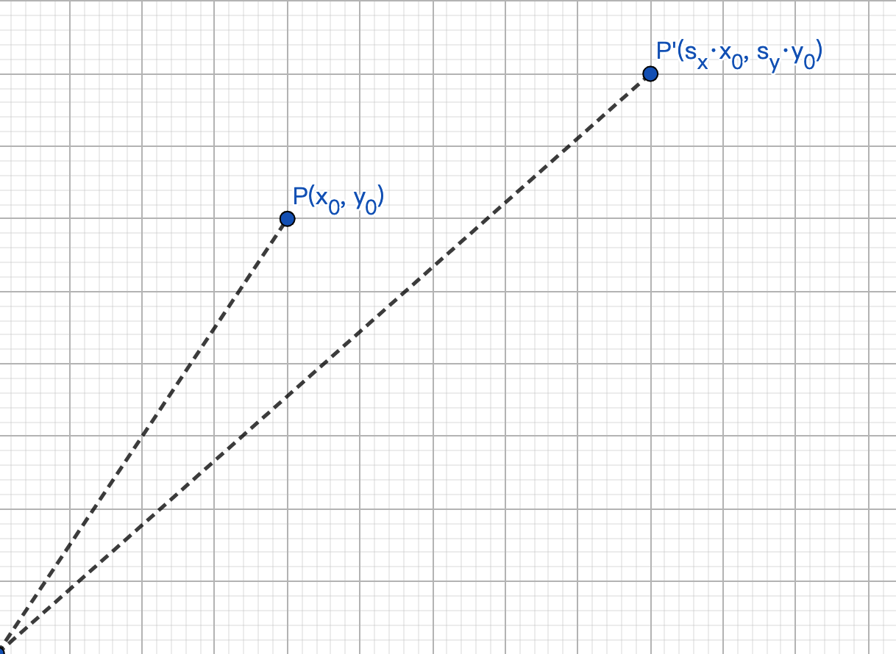
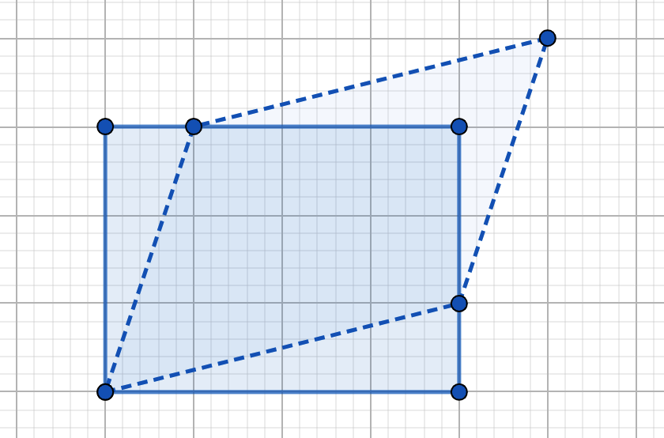
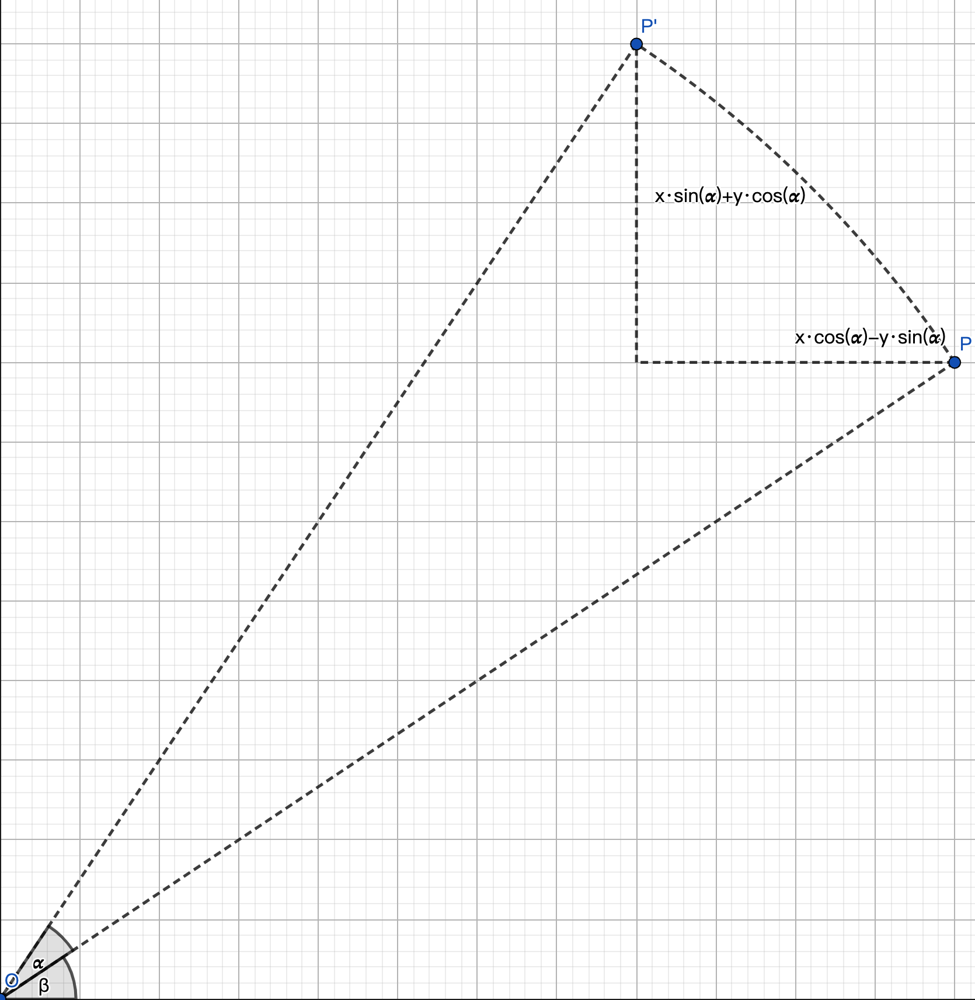
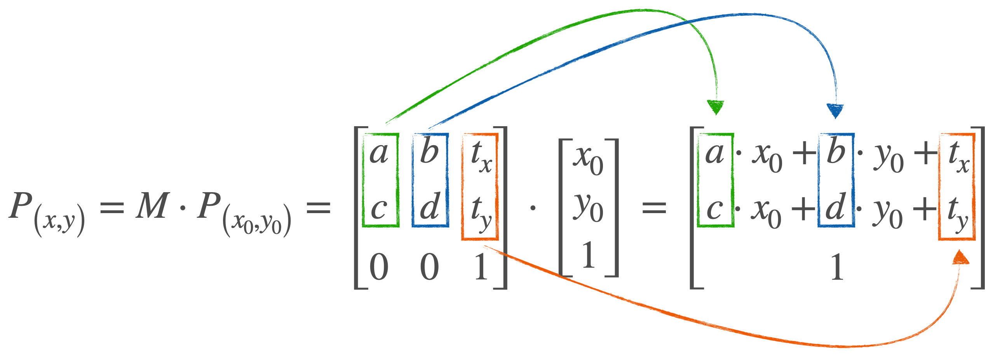
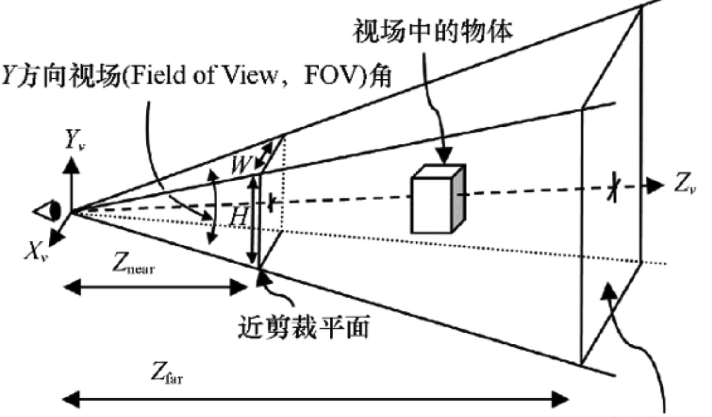
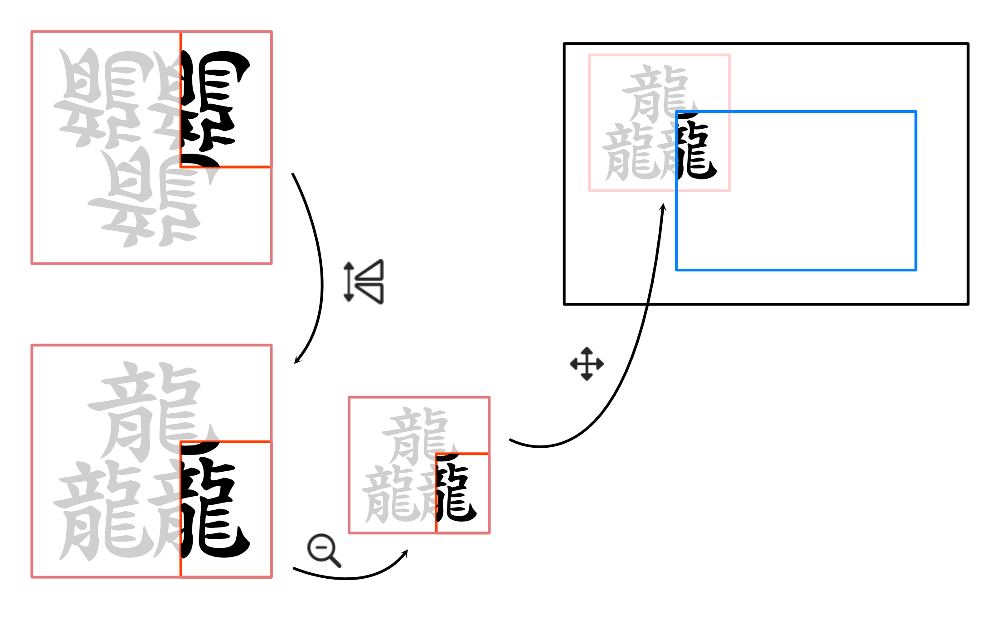
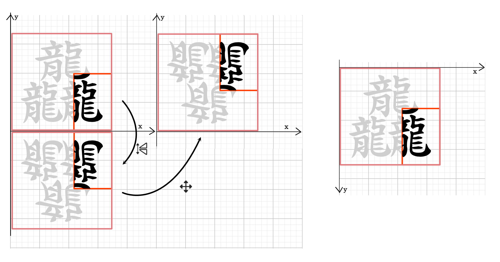

# 一、线性代数和矩阵运算基础

## 向量和矩阵的定义

向量可以被定义为具有大小和方向的量。在计算中，我们通常将向量视为一维数组。

矩阵可以被定义为二维数组，其中的每个元素被一个行索引和一个列索引确定。例如，一个$M \times N$的矩阵A可以被表示为：

$$
A = \begin{bmatrix} a_{11} & a_{12} & \cdots & a_{1n} \\ a_{21} & a_{22} & \cdots & a_{2n} \\ \vdots  & \vdots  & \ddots & \vdots  \\ a_{m1} & a_{m2} & \cdots & a_{mn} \end{bmatrix}
$$

## 矩阵的加法、减法、乘法

**加法**：两个大小相同的矩阵可以相加，相加的结果是一个新的矩阵，其每个元素都是原来两个矩阵相对应元素的和。

$$
A+B=\begin{bmatrix}a_{11} & a_{12} & \cdots & a_{1n}\\ a_{21} & a_{22} & \cdots & a_{2n}\\ \vdots & \vdots & \ddots & \vdots\\ a_{m1} & a_{m2} & \cdots & a_{mn}\end{bmatrix}+\begin{bmatrix}b_{11} & b_{12} & \cdots & b_{1n}\\ b_{21} & b_{22} & \cdots & b_{2n}\\ \vdots & \vdots & \ddots & \vdots\\ b_{m1} & b_{m2} & \cdots & b_{mn}\end{bmatrix}=\begin{bmatrix}a_{11}+b_{11} & a_{12}+b_{12} & \cdots & a_{1n}+b_{1n}\\ a_{21}+b_{21} & a_{22}+b_{22} & \cdots & a_{2n}+b_{2n}\\ \vdots & \vdots & \ddots & \vdots\\ a_{m1}+b_{m1} & a_{m2}+b_{m2} & \cdots & a_{mn}+b_{mn}\end{bmatrix}
$$

**减法**：矩阵的减法与加法类似，只不过是对应元素相减。

**乘法**：两个矩阵可以相乘，如果第一个矩阵的列数等于第二个矩阵的行数。结果矩阵的每个元素是通过将第一个矩阵的行元素与第二个矩阵的列元素相乘并求和得到的。

$$
\left(u,v\right)\cdot\left(v,w\right)=\left(u,w\right)
$$

​​

## 矩阵的转置、求逆等基本运算

**转置**：矩阵的转置是通过将所有行变为列（或将所有列变为行）来获得新的矩阵。沿对角线翻转

$$
A^{T}=\begin{bmatrix}a_{11} & a_{12} & \cdots & a_{1n}\\ a_{21} & a_{22} & \cdots & a_{2n}\\ \vdots & \vdots & \ddots & \vdots\\ a_{m1} & a_{m2} & \cdots & a_{mn}\end{bmatrix}^{T}=\begin{bmatrix}a_{11} & a_{21} & \cdots & a_{m1}\\ a_{12} & a_{22} & \cdots & a_{m2}\\ \vdots & \vdots & \ddots & \vdots\\ a_{1n} & a_{2n} & \cdots & a_{mn}\end{bmatrix}
$$


**求逆**：只有方阵（行数和列数相等的矩阵）**可能**有逆矩阵。如果存在一个矩阵B，使得给定的矩阵A与B相乘的结果是单位矩阵，则B被称为A的逆矩阵。

$$
A^{-1}\cdot A=E
$$

$$
\begin{matrix}A^{\prime}=P\cdot A\\ A=E\cdot A=\left(P^{-1}\cdot P\right)\cdot A=P^{-1}\cdot\left(P\cdot A\right)=P^{-1}\cdot A^{\prime}\\ P^{-1}A^{\prime}=P^{-1}\cdot\left(P\cdot A\right)=\left(P^{-1}\cdot P\right)\cdot A=E\cdot A=A\end{matrix}
$$

## 特性：

|特性|是否满足|备注|
| --------| ----------------| ----------------------------------------------|
|结合律|✅|可以把多个矩阵打包运算|
|交换律|❌|交换矩阵的顺序可能导致结果不同，甚至无法计算|
|可逆|特定条件下满足||

# 二、仿射变换矩阵

仿射变换可以完成：**平移**、**缩放**、**错位**、**旋转**等操作

一般来说，仿射变换是指将一个向量空间进行一次线性变换（linear transformation）和一次平移（translation），变换到另一个向量空间的操作。  
通常仿射变换对点、线、面具有一定的保持性，这种保持性体现在：

- 经过变换后，点还是点，线还是线，面还是面（如果不是仿射变换而是3D投影的话，在一定的视角下，面有可能变成线，线有可能变成点）

- 经过变换后，平行线和平行面依然平行

- 经过变换后，图形间的某些比例关系保持不变，比如两条平行线的长度比不变，点在线段中的位置比例保持不变

## 用矩阵（向量）表示一个点

在齐次坐标下表示为

$$
P_{(x,y)}=\begin{bmatrix}x\\ y\\ 1\end{bmatrix}
$$

## 平移变换矩阵及运算

​​​​

一般情况下，平移一个点

$$
P_{\left(x,y\right)}=\left\{\begin{matrix}x_{}=x_0+t_{x}\\ y_{}=y_0+t_{y}\end{matrix}\right.
$$

平移变换可以将对象移动到新的位置。平移变换矩阵通常在齐次坐标下表示，例如在二维空间中：

$$
T = \begin{bmatrix} 1 & 0 & t_x \\ 0 & 1 & t_y \\ 0 & 0 & 1 \end{bmatrix}
$$

增加矩阵运算后

$$
P_{\left(x,y\right)}=T\cdot P_{\left(x_0,y_0\right)}=\begin{bmatrix}1 & 0 & t_{x}\\ 0 & 1 & t_{y}\\ 0 & 0 & 1\end{bmatrix}\cdot\begin{bmatrix}x_0\\ y_0\\ 1\end{bmatrix}=\begin{bmatrix}x_0+t_{x}\\ y_0+t_{y}\\ 1\end{bmatrix}
$$

## 缩放变换矩阵及运算



一般情况下，缩放一个点（相对于原点$_{(0, 0)}$）

$$
P_{\left(x,y\right)}=\left\{\begin{matrix}x_{}=s_{x}\cdot x_0\\ y_{}=s_{y}\cdot y_0\end{matrix}\right.
$$

缩放变换可以改变对象的大小。二维空间的缩放变换矩阵如下：

$$
S=\begin{bmatrix}s_{x} & 0 & 0\\ 0 & s_{y} & 0\\ 0 & 0 & 1\end{bmatrix}
$$

增加矩阵运算后

$$
P_{\left(x,y\right)}=S\cdot P_{\left(x_0,y_0\right)}=\begin{bmatrix}s_{x} & 0 & 0\\ 0 & s_{y} & 0\\ 0 & 0 & 1\end{bmatrix}\cdot\begin{bmatrix}x_0\\ y_0\\ 1\end{bmatrix}=\begin{bmatrix}s_{x}\cdot x_0\\ s_{y}\cdot y_0\\ 1\end{bmatrix}
$$

缩放矩阵不止可以**正向**缩放，如果缩放比例为负数，则可以完成坐标系的变换。如

$$
S=\begin{bmatrix}-s_{x} & 0 & 0\\ 0 & s_{y} & 0\\ 0 & 0 & 1\end{bmatrix},\left(s_{x},s_{y}>0\right)
$$

应用到坐标后为：

$$
P_{\left(x,y\right)}=S\cdot P_{\left(x_0,y_0\right)}=\begin{bmatrix}-s_{x} & 0 & 0\\ 0 & s_{y} & 0\\ 0 & 0 & 1\end{bmatrix}\cdot\begin{bmatrix}x_0\\ y_0\\ 1\end{bmatrix}=\begin{bmatrix}-s_{x}\cdot x_0\\ s_{y}\cdot y_0\\ 1\end{bmatrix}
$$

可以将原坐标对y轴对称，如果对另一个系数也做出同样的行为，即可对x轴对称。

还可以实现将x，y轴对换的效果，即$\left\{\begin{matrix} x=y_0 \\ y=x_0 \end{matrix}\right.$

使用矩阵

$$
\begin{bmatrix}0 & 1 & 0\\ 1 & 0 & 0\\ 0 & 0 & 1\end{bmatrix}
$$

## 错位变换矩阵及其运算

​​

一般情况下，错位变换一个点（相对于原点$_{(0, 0)}$）

$$
P_{\left(x,y\right)}=\left\{\begin{matrix}x_{}=x_0+c_{x}\cdot y_0\\ y_{}=y_0+c_{y}\cdot x_0\end{matrix}\right.
$$

错位变换矩阵可以让形状错位，用矩阵表示如下：

$$
C=\begin{bmatrix}1 & c_{x} & 0\\ c_{y} & 1 & 0\\ 0 & 0 & 1\end{bmatrix}
$$

增加矩阵运算后

$$
P_{\left(x,y\right)}=C\cdot P_{\left(x_0,y_0\right)}=\begin{bmatrix}1 & c_{x} & 0\\ c_{y} & 1 & 0\\ 0 & 0 & 1\end{bmatrix}\cdot\begin{bmatrix}x_0\\ y_0\\ 1\end{bmatrix}=\begin{bmatrix}x_0+c_{x}\cdot y_0\\ y_0+c_{y}\cdot x_0\\ 1\end{bmatrix}
$$

## 旋转变换矩阵及运算



极坐标表示二维直角坐标系的一个点：

$$
P_{\left(x,y\right)}=\left\{\begin{matrix}x_{}=\rho\cdot\cos\left(\theta\right)\\ y_{}=\rho\cdot\sin\left(\theta\right)\end{matrix}\right.
$$

一般情况下，使用极坐标，非常容易表达一个点在空间中的旋转，公式如下：

$$
P_{\left(\rho,\theta\right)}=\left(\rho_0,\theta_0+\theta\right)
$$

经过推导得到在二维直角坐标系中的点旋转公式为(推导过程参见附录)：

$$
P_{\left(x,y\right)}=\left\{\begin{matrix}x_{}=x_0\cdot\cos\left(\theta\right)-y_0\cdot\sin\left(\theta\right)\\ y_{}=x_0\cdot\sin\left(\theta\right)+y_0\cdot\cos\left(\theta\right)\end{matrix}\right.
$$

旋转变换可以将对象围绕原点旋转特定角度。二维空间的旋转变换矩阵如下：

$$
R=\begin{bmatrix}\cos(\theta) & -\sin(\theta) & 0\\ \sin(\theta) & \cos(\theta) & 0\\ 0 & 0 & 1\end{bmatrix}
$$

增加矩阵运算后：

$$
P_{\left(x,y\right)}=R\cdot P_{\left(x_0,y_0\right)}=\begin{bmatrix}\cos\left(\theta\right) & -\sin\left(\theta\right) & 0\\ \sin\left(\theta\right) & \cos\left(\theta\right) & 0\\ 0 & 0 & 1\end{bmatrix}\cdot\begin{bmatrix}x_0\\ y_0\\ 1\end{bmatrix}=\begin{bmatrix}x_0\cdot\cos\left(\theta\right)-y_0\cdot\sin\left(\theta\right)\\ x_0\cdot\sin\left(\theta\right)+y_0\cdot\cos\left(\theta\right)\\ 1\end{bmatrix}
$$

## 透视变换矩阵及运算

透视变换（Perspective Transformation）是将二维的图片投影到一个三维视平面上，然后再转换到二维坐标下，所以也称为投影映射（Projective Mapping）。简单来说就是**二维→三维→二维**的一个过程。

由于计算稍微复杂，目前我们使用的也比较少，暂时不做解释。

## 组合多个基本变换的运算

可以通过矩阵乘法将多个基本变换组合在一起，得到一个新的变换矩阵。这个新的变换矩阵可以同时应用所有的基本变换。

综上，我们约定

|类型|符号|
| ------| :----: |
|平移|T|
|缩放|S|
|错位|C|
|旋转|R|

那么，如果我们想实现对点P一个先平移T1再缩放S1再旋转R1的效果，我们可以做写出如下的公式

$$
\begin{matrix}P^{\prime}=T_1\cdot P\\ P^{\prime\prime}=S_1\cdot P^{\prime}\\ P^{\prime\prime\prime}=R_1\cdot P^{\prime\prime}\\ P^{\prime\prime\prime}=R_1\cdot\left(S_1\cdot\left(T_1\cdot P\right)\right)\\ P^{\prime\prime\prime}=\left(_{}R_1\cdot S_1\cdot T_1\right)\cdot P\end{matrix}
$$

从上述公式来看，最后的所有变换可以括在一起当做一个整体提前运算，那么我们：

$$
M=R_1\cdot S_1\cdot T_1
$$

则：

$$
P^{\prime\prime\prime}=M\cdot P
$$

所以，各种变换可以提前计算好，然后再施加给想要变换的坐标。在这种情况下，我们还可以复用变换矩阵到每一个想要计算的点上，从而大量降低计算消耗。

由第一节的矩阵基本运算可知，如果想要从$P^{\prime\prime\prime}$计算得到$P$，则可以简单的求的$M$的逆矩阵$M_{-1}$。即：

$$
P=M^{-1}\cdot P^{\prime\prime\prime}
$$

## 并行计算多个坐标

假如对$n$个点做$M$变换，则n个点的矩阵表示入下所示：

$$
P_{set}=\begin{bmatrix}x_0 & y_0 & 1\\ x_1 & y_1 & 1\\ \ldots & \ldots & \ldots\\ x_{n} & y_{n} & 1\end{bmatrix}^{T}=\begin{bmatrix}x_0 & x_1 & \ldots & x_{n}\\ y_0 & y_1 & \ldots & y_{n}\\ 1 & 1 & \ldots & 1\end{bmatrix}
$$

则，做出变化如下所示：

$$
P_{set}^{\prime}=M\cdot P_{set}=\begin{bmatrix}a\cdot{}x_0+b & c\cdot y_0+d & 1\\ a\cdot{}x_1+b & c\cdot{}y_1+d & 1\\ \ldots & \ldots & \ldots\\ a\cdot{}x_{n}+b & c\cdot{}y_{n}+d & 1\end{bmatrix}^{T}
$$

由上可知，M阵的shape为$(3,3)$，$P_{set}$的shape为$(3, n)$，则从shape的矩阵运算前后结果来看

$$
(3,3)\cdot\left(3,n\right)=\left(3,n\right)
$$

仍为3行（坐标）和n个点。

## 可视化理解矩阵变换

$$
P_{\left(x,y\right)}=M\cdot P_{\left(x_0,y_0\right)}=\begin{bmatrix}a & b & t_{x}\\ c & d & t_{y}\\ 0 & 0 & 1\end{bmatrix}\cdot\begin{bmatrix}x_0\\ y_0\\ 1\end{bmatrix}=\begin{bmatrix}a\cdot x_0+b\cdot y_0+t_{x}\\ c\cdot x_0+d\cdot y_0+t_{y}\\ 1\end{bmatrix}
$$

从图中可以看出，绿色主要影响x坐标的缩放，蓝色主要影响y坐标的缩放，橙色则负责对坐标的偏移。



# 三、视角变换矩阵（三维）

视角变换矩阵是一种特殊的仿射变换矩阵，可以将3D世界中的点投影到2D图像平面上，从而模拟摄像机的视点。

## 视角变换与投影变换矩阵



**投影变换矩阵(Projection Matrix):**

1. 正交投影(Orthographic Projection):

$$
P_{ortho} = \begin{bmatrix}
scale & 0 & 0 & 0\\
0 & scale & 0 & 0\\
0 & 0 & -f & -nf\\
0 & 0 & 0 & 1\\
\end{bmatrix}
$$

2. 透视投影(Perspective Projection):

$$
P_{perspective} = \begin{bmatrix}
\frac{1}{tan(\theta/2)} & 0 & 0 & 0\\
0 & \frac{1}{sin(\theta)/cos(\theta)} & 0 & 0\\
0 & 0 & -f & -nf\\
0 & 0 & -1 & 0
\end{bmatrix}
$$

其中 $\theta$ 是视场角度，$f$ 是近平面距离，$n$ 是远平面与近平面距离之比。

## 正交投影和透视投影区别

正交投影和透视投影是两种常见的投影方法。正交投影保持物体的相对大小和形状，但不会有深度透视效果，适用于工程和建筑绘图。透视投影会有深度透视效果，更接近人眼看到的世界，适用于3D游戏和动画。

# 四、GPU中的矩阵运算

## GPU架构简介

GPU（图形处理单元）是一种专门处理图形渲染任务的硬件设备。现代GPU也被用来处理一些并行计算任务，因为它们具有许多并行处理单元，可以同时处理大量的数据。

## 如何在GPU上进行矩阵运算加速

在GPU上进行矩阵运算的一种常见方法是使用CUDA或OpenCL的并行编程模型。具体操作包括将矩阵数据传输到GPU，编写并行代码来执行矩阵运算，然后将结果传回CPU。由于GPU的并行处理能力，这种方式通常比在CPU上执行矩阵运算要快得多。  

### vglite提供的一些API

|函数|功能||
| ---------------------| ----------| ----------------------------|
|vg_lite_identity|单位矩阵|$I=\begin{bmatrix}1 & 0 & 0\\ 0 & 1 & 0\\ 0 & 0 & 1\end{bmatrix}$|
|multiply|点乘|$A\cdot B$|
|vg_lite_translate|平移|$T=\begin{bmatrix}1 & 0 & t_{x}\\ 0 & 1 & t_{y}\\ 0 & 0 & 1\end{bmatrix}$<br />|
|vg_lite_scale|缩放|$S=\begin{bmatrix}s_{x} & 0 & 0\\ 0 & s_{y} & 0\\ 0 & 0 & 1\end{bmatrix}$|
|vg_lite_rotate|旋转|$R=\begin{bmatrix}\cos(\theta) & -\sin(\theta) & 0\\ \sin(\theta) & \cos(\theta) & 0\\ 0 & 0 & 1\end{bmatrix}$|
|vg_lite_perspective|透视运算|$P=\begin{bmatrix}1 & 0 & 0\\ 0 & 1 & 0\\ p_{x} & p_{y} & 1\end{bmatrix}$|
||||
|vg_lite_draw|绘制|可以绘制时应用一个变换矩阵|

# 五、实际应用

## Freetype Outline绘制

主要经历以下步骤：

```markdown
1. 从Freetype中获取字形
2. lvgl根据字形尺寸信息对文字layout
3. 将layout后的缩放信息以及裁剪区映射到单个字体的局部坐标系，并裁切
4. 将裁切后的文字缩放并平移到lvgl给出的坐标处
```

整体流程：



局部变换细节：



1. 取freetype字形的bounding box坐标为$RECT_{glyph}=\begin{bmatrix}x_{g0} & x_{g1}\\ y_{g0} & y_{g1}\\ 1 & 1\end{bmatrix}$
2. 取字形从freetype坐标系到lvgl坐标系为 $T_{local}$，则$T_{local}=T_{local\_trans}\cdot S_{flip}=\begin{bmatrix}0 & 0 & 0\\ 0 & 0 & H_{glyph}\\ 0 & 0 & 1\end{bmatrix}\cdot\begin{bmatrix}1 & 0 & 0\\ 0 & -1 & 0\\ 0 & 0 & 1\end{bmatrix}=\begin{bmatrix}0 & 0 & 0\\ 0 & 0 & -H_{glyph}\\ 0 & 0 & 1\end{bmatrix}$（局部坐标系转换）
3. 取实际字形到lvgl缩放为$S$
4. 取lvgl中裁剪区（蓝色和红色交集）为$RECT_{crop}=\begin{bmatrix}0 & w_{crop}-1\\ 0 & h_{crop}-1\\ 1 & 1\end{bmatrix}$
5. 记$TRANS_{f2l}=S\cdot T_{local}$
6. 从freetype字形的bounding box到lvgl的裁剪区坐标转换为，$RECT_{crop}=S\cdot T_{local}\cdot RECT_{glyph}=\left(S\cdot T_{local}\right)\cdot RECT_{glyph}=TRANS_{f2l}\cdot RECT_{glyph}$
7. 因此，从lvgl裁剪区反推freetype的bounding box为$RECT_{glyph}={TRANS_{f2l}}^{-1}\cdot RECT_{crop}$
8. 将freetpye字形绘制在屏幕上时，再施加一个平移矩阵即$RECT_{real}=T_{trans}\cdot RECT_{crop}$(世界坐标系转换)

# 六、其他应用

## 3D图形渲染中的矩阵运算

在3D图形渲染中，矩阵运算被用于执行各种变换，包括模型变换、视图变换和投影变换。这些变换可以将3D模型从其本地坐标系转换到世界坐标系，再从世界坐标系转换到摄像机坐标系，最后从摄像机坐标系投影到2D图像平面。

## 机器学习中的矩阵运算加速

在机器学习中，许多算法包括大量的矩阵运算，例如线性回归、神经网络等。使用GPU进行这些矩阵运算可以大大加速这些算法的运行速度。

## 其他应用场景

除了上述应用，GPU加速的矩阵运算还被广泛应用于物理模拟、数字信号处理、图像和视频

# 参考文献

- https://blog.csdn.net/bby1987/article/details/105695509
- 《计算机图形学编程》
- 《计算机图形学 原理、算法、实践》

# 附录

## 旋转矩阵公式推导：

$$
\begin{array}{l}已知：\\ P_{(x,y)}=\begin{cases}x=\rho\cdot{}\cos\left(\theta\right)\\ y=\rho\cdot\sin\left(\theta\right)\end{cases}=P_{\left(\rho,\theta\right)}\\ \\ 取P_{(x_0,y_0)}为旋转起始点，对应的极坐标为P_{(\rho_0,\theta_0)}\\\\ 当增加\alpha角度后P_{\left(\rho_0,\theta_0+\alpha\right)}转换为二维直角坐标系为\\ \\ \begin{align}P_{\left(x,y\right)} & =\begin{cases}x=\rho_0\cdot{}\cos\left(\theta_0+\alpha\right)\\ y=\rho_0\cdot\sin\left(\theta_0+\alpha\right)\end{cases}\\  & =\begin{cases}x=\rho_0\cdot\cos\left(\theta_0\right)\cdot\cos\left(\alpha_0\right)-\rho_0\cdot\sin\left(\theta_0\right)\cdot\sin\left(\alpha_0\right)\\ y=\rho_0\cdot\sin\left(\theta_0\right)\cdot\cos\left(\alpha_0\right)+\rho_0\cdot\cos\left(\theta_0\right)\cdot\sin\left(\alpha_0\right)\end{cases}\\  & =\begin{cases}x=x_0\cdot\cos\left(\alpha\right)-y_0\cdot\sin\left(\alpha\right)\\ y=x_0\cdot\sin\left(\alpha\right)+y_0\cdot\cos\left(\alpha\right)\end{cases}\end{align}\\ \\ 整理成矩阵形式为\begin{bmatrix}\cos\left(\alpha\right) & -\sin\left(\alpha\right)\\ \sin\left(\alpha\right) & \cos\left(\alpha\right)\end{bmatrix}\\ \\ 写成齐次形式为\begin{bmatrix}\cos\left(\alpha\right) & -\sin\left(\alpha\right) & 0\\ \sin\left(\alpha\right) & \cos\left(\alpha\right) & 0\\ 0 & 0 & 1\end{bmatrix}\end{array}
$$

‍
