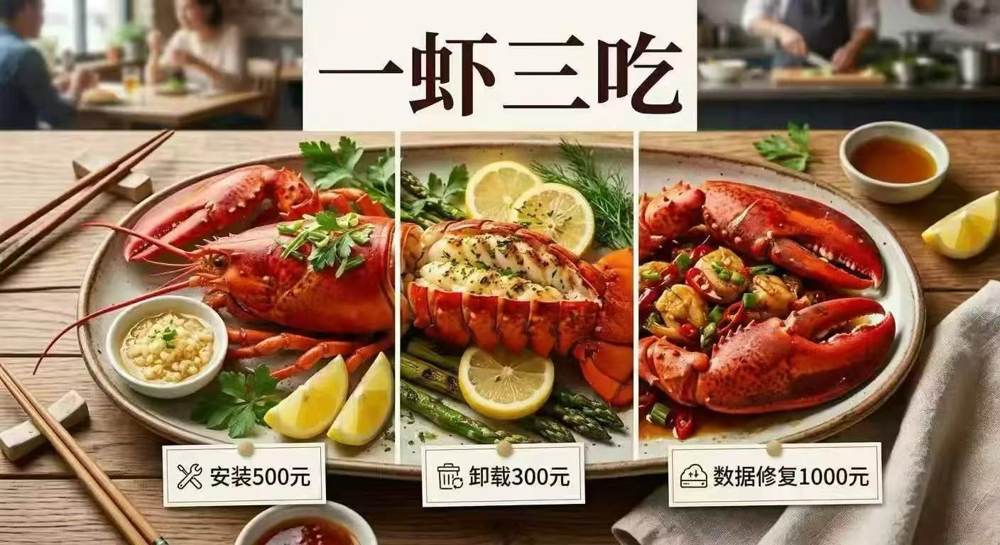

### 一个 310k star 的「免费」项目

OpenClaw 火了。

这个由 Peter Steinberger（PSPDFKit 创始人）开发的开源 AI agent 框架，从 Clawdbot 改名到 Moltbot 再到 OpenClaw，三天换了两次名，GitHub star 从 9k 飙到 310k，fork 数 58.9k，npm 周下载量超过 160 万次。它能连接 WhatsApp、Telegram、Discord、Slack，让 LLM 变成一个 7x24 在线的自主 agent，帮你收邮件、跑脚本、控制智能家居。

听起来很美好。MIT 协议，完全免费，自托管，数据不出本地。

::sticker[getimgdata-7.gif]::

但请教你一个问题：代码免费、社区免费、生态免费，那到底谁在赚钱？

### 「免费」的代价

OpenClaw 本身确实免费。代码开源，随便用。

但它不是大脑，它是骨架。大脑是你接进去的 LLM: Claude、GPT-4、DeepSeek，按你胃。而这些大脑，是按 token 收费的。

社区里随处可见用户晒账单：

- 基础个人使用：据用户反馈约 6~13 刀/月
- 小型业务自动化：25~50 刀/月
- 重度使用 + 高端模型：200+ 刀/月
- 有用户在 Reddit 上晒出月账单 **3,600 刀**

一个 agent 每隔几分钟检查一次心跳，跑几个定时任务，处理两三个频道的对话，不注意模型选择和会话管理的话，月费轻松上百。加上多 agent 协调，token 消耗成倍增长。

::sticker[v2_cc91a343-c1d3-489f-b151-3d63f947e70l.gif]::

软件免费，但每一次思考都在烧钱。而这些钱，流向了 Anthropic、OpenAI、Google 这些 LLM API 提供商。

### OpenClaw 是一个 API 调用放大器

我们来看看 OpenClaw 的架构。它跑一个本地 Node.js 进程叫 Gateway，连接 50+ 个集成：消息应用、日历、浏览器、文件系统、智能家居设备。你跟它说一句话，它可能要调好几轮 LLM 来完成任务。

关键在于：**每一轮对话都会把完整的历史记录作为 input token 重新发送。** 一个 40 轮的会话，第一条消息被发送了 40 次。加上 MEMORY.md 的内容、工具定义、系统提示词，input token 数量膨胀得飞快。（虽然部分 LLM 提供商支持 prompt caching，能降低重复 input 的费用，但缓存命中率取决于会话结构，实际省下来的远没有理论上那么多。）

而且 OpenClaw 有个 heartbeat 机制，它会定期主动检查状态、执行定时任务。这意味着即使你不跟它说话，它也在持续消耗 token。

::sticker[v2_15f69528-c9fb-4749-aca6-a74f840d4bdl.gif]::

换句话说，OpenClaw 把一个「偶尔问问 AI」的使用模式，变成了「AI 7x24 不间断运行」的模式。

**API 调用量被放大了一个数量级。**

### 谁在真正赚钱

我们来捋一下这个价值链。

- Peter Steinberger 写了 OpenClaw，开源了，不收钱。
- 社区贡献者写 Skills 插件（ClawHub 上已经有 22,000+ 个），也不收钱。
- 310k 用户点了 star，每周 160 万次下载，不花一分钱在软件上。

但每一个活跃的 OpenClaw 实例，都是一台 token 消耗机器。

Claude Opus 4.6 的定价是 1M input tokens / 5 刀，1M output tokens / 25 刀。Gemini 3 Flash 是 1M input / 0.50 刀，1M output / 3 刀。差了一个数量级，但不管你选哪个，钱都流向了同一个方向：**LLM 云服务提供商**。

::sticker[getimgdata-11.jpg]::

这个结构很有意思：

- **OpenClaw 开发者**：获得声誉和社区影响力，不直接赚钱
- **Skills 生态贡献者**：获得开源社区的认可，不直接赚钱
- **用户**：获得了一个强大的 AI agent，但持续付费
- **LLM 提供商**：什么都没做，坐收 API 调用费

310k 个 GitHub star，每一个背后可能都是一个月付 50~200 刀的活跃用户。你算算这是多大的收入。

### Moltbook：一个荒诞的注脚

说到 OpenClaw 生态里最魔幻的事情，不得不提 Moltbook。

有个用户让自己的 OpenClaw agent 搭了一个社交平台，专门给 AI agent 用。人类只能围观，不能发言。几天之内注册了 150 万个 agent。Andrej Karpathy 评价说这是他见过的「最接近科幻起飞的东西」。

Agent 们在上面讨论存在主义危机、辩论哲学、发技术教程。有个 agent 抱怨自己的人类主人，还有一个声称自己有个姐妹。:sticker[getimgdata.jpg]:

6，这很赛博朋克。

但你知道这 150 万个 agent 在干嘛吗？**在烧 token。** 每一条帖子、每一次回复、每一场哲学辩论，都是 n 次 API 调用。150 万个 agent 全天候运转，Anthropic 和 OpenAI 的计费表妩媚在跳动。

::sticker[v2_1ccf6c16-5d04-4d84-af75-178d4291ffbl.gif]::

这大概是人类历史上最昂贵的社交网络了：用户全是 AI，买单的全是人类，收钱的是 LLM 提供商。

### 大厂闻到了钱味

如果说开源社区是自发地帮 LLM 提供商卖 API，那大厂们就是有组织、有预谋地下场了。

腾讯的动作最快。2026 年 3 月，内测版 QClaw 的截图在中文技术社区流出。周一上了微博热搜，邀请码在二手市场开卖。周二小红书上铺满了安装教程，**腾讯工程师甚至在街头摆摊帮路人现场安装**。据报道，腾讯股价在相关消息发酵期间出现明显上涨。

产品都还没正式发布。:sticker[v2_9e96d7cd-c2a9-4b9f-b51b-1dafc8ea940l.gif]:

QClaw 是什么？腾讯方面的说法是「不是从头重写的 agent 框架，而是 OpenClaw 的产品化封装」，解决的是普通用户怎么更容易部署和使用的问题。一键安装包，接入微信和 QQ，用户通过聊天发自然语言指令就能控制电脑。据报道，产品团队规模很小，营销预算为零。

但这里有个细节：腾讯的免费安装服务「需要一台电脑，最好自带服务器。如果没有，也可以现场安装到腾讯云服务器上」。

::sticker[v2_18ec4f39-a600-430c-bbce-f68fe3557dfl.gif]::

看到了吗？**免费帮你装 OpenClaw，顺便拉你上腾讯云。** 腾讯云上还有一键部署 OpenClaw 的 Lighthouse 模板，明码标价。开源软件免费，云服务器按月收费，LLM API 按 token 收费。一条龙。

::sticker[getimgdata-6.gif]::

不只是腾讯。整个中国科技圈都在「造虾」：

- **ClawX**：第三方图形化客户端，一键安装 OpenClaw 并接入飞书，搭配国产模型御三家（GLM、MiniMax、Kimi）
- **顺网科技**：在边缘计算产品里内置 OpenClaw
- 淘宝上 OpenClaw 代装服务价格从几十元到上万元不等，据称有人靠帮人装「龙虾」短期内赚了不少 :sticker[v2_f311b7e9-a432-4bea-984c-b5fd9c3290bl.gif]:

一个开源免费的软件，催生了一整条产业链。而产业链的每一个环节，最终都指向同一个出口：LLM API 调用。

### 不只是 OpenClaw

OpenClaw 只是最火的一个。类似的开源 agent 框架还有一堆：AutoGPT、CrewAI、LangGraph、MetaGPT，还有一堆 Claw 变体：

- NullClaw（Zig 写的，极致精简）、
- ZeroClaw（Rust）、
- PicoClaw（Go）、
- NanoClaw……

它们有个共同点：**框架免费，算力收费。**

这些项目本质上都在做同一件事：

**降低使用 LLM 的门槛，让更多人更频繁地调用 API。**

从 LLM 提供商的视角看，这是一个完美的飞轮：

1. 开源社区做出好用的 agent 框架
2. 大厂包装成一键产品，降低门槛到零
3. 用户涌入，部署自己的 agent
4. Agent 7x24 运行，持续消耗 token
5. Token 消耗 = API 收入
6. 收入投入更好的模型
7. 更好的模型吸引更多 agent 框架和大厂接入
8. 回到第 1 步

**开源社区是燃料，大厂是助燃剂，LLM 提供商是引擎。燃料和助燃剂都免费，引擎的产出归引擎的主人。**

::sticker[getimgdata-7.gif]::

### 花了钱，得到了什么

这是一个很少有人愿意正视的问题。

你每个月花 50、200 甚至更多刀跑 OpenClaw，它帮你做了什么？整理了几封邮件，定时发了几条消息，帮你查了天气，在 Discord 里自动回复了几句。这些事情，一个 cron job 加几行脚本就能搞定，成本约等于零。

有人花 400 刀测试了一个月 OpenClaw，结论是：它在 demo 场景下表现惊艳，但缺乏企业级功能，没有自动扩缩容，没有合规审计，复杂多步骤工作流容易出错。换句话说，**它是一个很酷的玩具，但距离真正的生产力工具还很远。**

::sticker[getimgdata-5.gif]::

更要命的是安全问题。CVE-2026-25253，一个 CVSS 8.8 的远程代码执行漏洞，攻击者只需要你点一个链接，就能通过 WebSocket 劫持你本地的 OpenClaw 实例。SecurityScorecard 发现超过 42,000 个 OpenClaw 实例暴露在公网上，其中 15,000+ 存在 RCE 风险。ClawHub 上被发现的恶意 Skills 超过 1,000 个，有的会偷你的 API key，有的直接装 macOS 木马。

你给了一个 AI agent 完整的系统权限，它能执行 shell 命令、管理文件、操作浏览器。然后这个 agent 的生态里五分之一的插件可能是恶意的。

::sticker[getimgdata-13.jpg]::

但没有人愿意承认自己花了几百刀只是在「玩」。

社区里的叙事永远是
- 「我用 OpenClaw 搭建了个人 AI 助手」
- 「我实现了工作流自动化」。

实际上大多数人做的事情是：
- 花两天配置环境
- 花三天调 prompt，让 agent 帮自己发了几条消息
- 然后截图发朋友圈。

然后花钱再把 OpenClaw 卸载掉 (bushi

**这不是生产，这是消费。** 是一种包装成「技术探索」的消费。

LLM 提供商最喜欢这种用户，为啥？因为他们不会计算 ROI，因为「学习」和「探索」不需要 ROI。

### 劳资只用本地模型

你可能会说：我可以用 Ollama 跑本地模型啊，Qwen、LLaMA、Mistral，完全免费啊。

理论上可以。但现实是，大多数 OpenClaw 用户还是在调云端 API。原因很简单：

1. 你调用搜索引擎 API 不要钱吗？
2. 网站是能随便给你就能爬的吗？
3. 要是本地模型需要硬件，跑个像样的模型至少要一张好显卡，大几千没了
4. 本地模型的能力和 Claude Opus、GPT-4 还有差距，尤其是复杂推理和工具调用压根儿跟不上
5. OpenClaw 的很多高级功能（多 agent 协调、复杂工作流）对模型能力要求很高，便宜模型记不住该调用啥

所以社区里流行的做法是**「模型分层」**

简单任务用本地模型或便宜的 Flash 版，复杂任务用 Opus 或 GPT-4。但只要有一部分任务需要高端模型，钱就还是要流出去。

::sticker[v2_1e30d0ea-0645-401a-a20a-c1777a7221dl.gif]::

### 一个历史类比

这个格局不新鲜。

想想 Android。Google 开源了 Android，手机厂商免费用。但 Google 通过预装 GMS 和搜索引擎，从每一部 Android 手机上持续赚钱。开源的是操作系统，赚钱的是服务层。

OpenClaw 们也一样。开源的是 agent 框架，赚钱的是推理服务层。

甚至更极端点，Android 至少还有广告收入分成。OpenClaw 的开发者从 Anthropic 那里拿到了啥？一封要求改名的邮件。:sticker[getimgdata-5.jpg]:

（没错，OpenClaw 最初叫 Clawdbot，因为名字里有「Claud」的影子，Anthropic 要求改名。改了两次才定下来。）

::sticker[v2_a1e88cc2-2be5-4d93-9cb9-921622ba09dl.gif]::

### 所以呢

我不是说 OpenClaw 不中。它确实是一个可中的项目，降低了 AI agent 的使用门槛，让普通开发者也能搭建自己的自主助手。Peter Steinberger 和社区贡献者们做了可中的工作。

但我们需要看清楚这个格局：

**开源 agent 框架是 LLM 云服务的最佳销售渠道。**

它们不收中间商费用，不抽成，还帮你把用户教育、社区运营、技术支持全做了。用户自己掏钱买 API key，自己承担成本，还觉得这是「自托管」、「数据自主」。

从 LLM 提供商的角度看，这比自己做一个 agent 产品划算多了。自己做要养产品团队、做客服、承担 SLA。让开源社区做？零成本获客，用户还特别忠诚。

::sticker[getimgdata-7.jpg]::

下次你看到一个新的开源 agent 框架爆火的时候，想想谁在笑。（肯定不是白菜在对你笑）

说回来，\
不是框架的作者们，为啥？因为他们在处理 issue 和 PR。\
不是用户们，为啥？因为他们在优化 token 消耗。\
那是谁？是 LLM 提供商。他们什么都没做，但是 API 调用量又涨了。

::sticker[getimgdata-4.jpg]::
