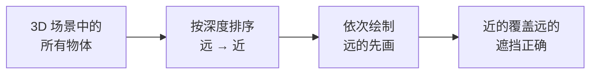

### 问题：Canvas 2D 没有 z-buffer

WebGL 有 z-buffer（深度缓冲），每个像素记录当前最近的深度值，新像素画上来的时候自动比较深度，近的留、远的丢。开发者不需要关心绘制顺序，GPU 帮你搞定遮挡。

Canvas 2D 没有这个东西。

Canvas 2D 的绘制模型是纯粹的 **画家模型**：后画的覆盖先画的，就像油画一样，一层一层往上刷。你先画了一个蓝色矩形，再画一个红色矩形盖在上面，蓝色就被盖住了。没有深度比较，没有自动遮挡，画的顺序就是最终结果。

这在 2D 场景下完全没问题。但如果你要在 Canvas 2D 上做 3D 渲染，遮挡关系就得自己处理了。

::sticker[getimgdata-7.gif]::

### Painter's Algorithm

思路很直觉：**既然后画的覆盖先画的，那就按深度从远到近排序，先画远的再画近的。** 近处的物体后画，自然就盖住了远处的。这就是 Painter's Algorithm（画家算法）。



实现就是一行 sort：

```typescript
items.sort((a, b) => b.z - a.z);  // far to near
```

排完序，按顺序画就行了。看起来很简单？确实。但 Painter's Algorithm 有几个经典的边界 case。

### 经典问题一：循环遮挡

三个三角形 A、B、C，A 挡住 B，B 挡住 C，C 又挡住 A。不管怎么排序，都画不对。


通用 3D 渲染里的解决方案通常是把三角形切割成更小的片段。但如果你的场景里所有面都平行于同一平面（只在 Z 轴上有不同深度），这个问题天然不存在：要么 A 在 B 前面，要么 B 在 A 前面，不会出现部分遮挡。

::sticker[v2_833ed88f-8315-4a5d-aced-dd9512438acl.gif]::

### 经典问题二：深度值相同

两个物体的深度完全一样怎么办？排序结果不确定，可能每帧闪烁（z-fighting 的排序版）。

解决方案是保证每个物体的深度值唯一。比如在展平对象树的时候，给每个层分配一个递增的整数深度值，同级节点按遍历顺序递增。这样即使视觉上层叠在一起，排序结果也是确定的。

还有一个细节：如果你的场景有「展开/折叠」的交互（比如 3D 爆炸视图），展开时层间距由 slider 控制，折叠时层间距趋近于零。这时候不能让间距真的变成 0，否则所有深度相同，排序又不稳定了。一个常见做法是给折叠状态一个极小的 fallback 间距（比如 `0.1`），肉眼看不出来，但足以保证排序稳定。

### 经典问题三：透明物体

对不透明物体，近处直接覆盖远处，没有问题。半透明物体就不一样了：Canvas 2D 默认的 [source-over 混合](/blog/blend-modes-explained/#normal-正常)不满足交换律，先画 A 再画 B 和先画 B 再画 A 结果不同。如果排序不稳定，每帧绘制顺序变化，画面就会闪烁。

解决方案和上面一样：保证深度值唯一，排序结果确定，混合结果就一致。

### 排序的代价

Painter's Algorithm 的时间复杂度是 $O(n \log n)$，n 是物体数量。几百个物体的场景开销可以忽略不计。

但如果物体数量上万，排序本身就会成为瓶颈。这也是为什么现代 GPU 用 z-buffer 而不是排序：z-buffer 是 $O(1)$ 的逐像素操作，不需要全局排序。

| 方案 | 时间复杂度 | 透明物体 | 循环遮挡 |
|------|-----------|---------|---------|
| z-buffer | $O(1)$ per pixel | ⚠️ 需要特殊处理 | ✅ 自动正确 |
| Painter's Algorithm | $O(n \log n)$ | ⚠️ 需要特殊处理 | ❌ 无法处理 |
| BSP Tree | $O(n)$ 遍历 | ✅ 正确排序 | ✅ 预处理时切割 |

BSP Tree（Binary Space Partitioning）是 Painter's Algorithm 的增强版，通过预处理把场景空间递归二分，解决循环遮挡问题。Doom（1993）就是用 BSP Tree 做的渲染。

### 排序键的选择

排序键应该是投影后的相机空间 Z 坐标，而不是原始深度值。为啥？因为旋转之后，原始深度不再代表「离相机的远近」。

举个例子：两个层，A 的 depth=1，B 的 depth=10。正面看的时候 A 在前面。但如果把场景旋转 180°，B 就跑到前面了。排序必须基于旋转后的相机空间坐标。

```typescript
// project returns [screenX, screenY, cameraZ]
const projected = project(x, y, depth);
// sort by camera-space Z, not original depth
items.sort((a, b) => b.z - a.z);
```

#### 用四个角的平均 Z 还是中心点 Z？

每个物体是一个矩形，投影后变成一个四边形。排序的时候用哪个点的 Z 值？

四个角投影后的平均 Z 是一个更稳健的近似：

```typescript
const avgZ = (p0[2] + p1[2] + p2[2] + p3[2]) / 4;
```

在极端旋转角度下，矩形的一端可能比另一端离相机近很多，用中心点的 Z 值可能不够准确。不过对于所有面都平行的场景，两者差异很小。

### 总结

Painter's Algorithm 是 Canvas 2D 做 3D 渲染时解决遮挡的标准方案。核心就一行 sort，但要注意：

- 排序键是相机空间的 Z 坐标，不是原始深度
- 循环遮挡无法处理，但平行平面的场景不会出现
- 透明物体需要稳定的排序顺序
- 深度值要保证唯一，避免闪烁

> 投影矩阵的数学原理可以参考 [矩阵运算在 GPU 中的应用](/blog/matrix-gpu)。近平面裁剪的问题在 [近平面裁剪：透视投影的边界处理](/blog/near-plane-clipping/#当-z---d-的时候) 里单独展开。

::sticker[v2_743a5aa2-4263-473b-b37d-d7206bf8deal.gif]::
