# 原理


利用 PyCharm 的 Python 调试服务器反向调试已经被 GDB 加载的 Python Script


# 步骤


## 1、新建一个 `PyCharm` 的 `Python Debug Server`


选择调试目标 -> 编辑配置


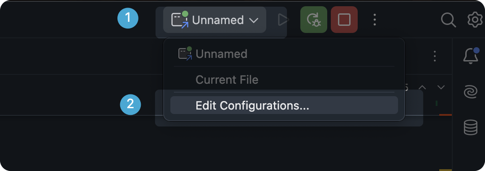


增加新的 Python Debug Server 配置


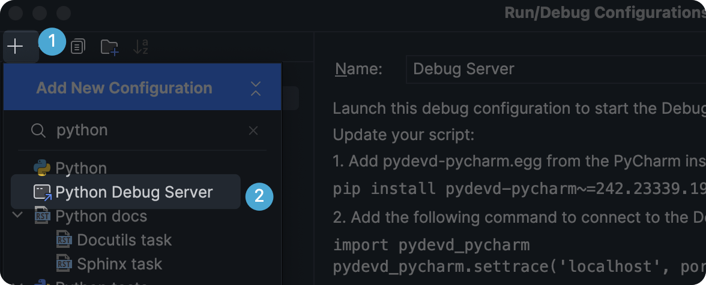


## 2、安装依赖


首先通过执行 `gdb -ex "python print(sys.executable)"` 的执行结果来确定当前的 `gdb` 使用的是哪一个 `Python` 可执行文件


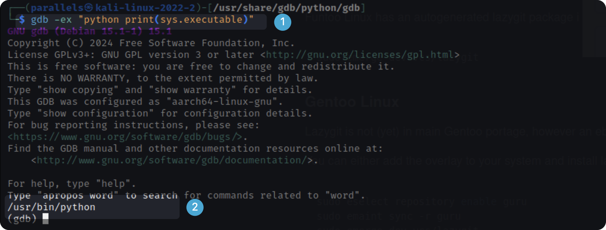


例如本教程使用的是 `/usr/bin/python`


然后根据下图 1 位置的代码，在终端中输入


```bash
/usr/bin/python -m 1 位置的代码
```


在本教程中就是


```bash
/usr/bin/python -m pip install pydevd-pycharm~=242.23339.19
```


然后在 3 的位置随机填写一个端口号，建议大于 1000，如果运行该配置时出现冲突，建议更换一个其他的端口号。


本教程使用的是 11451 端口 （最大为 65535）


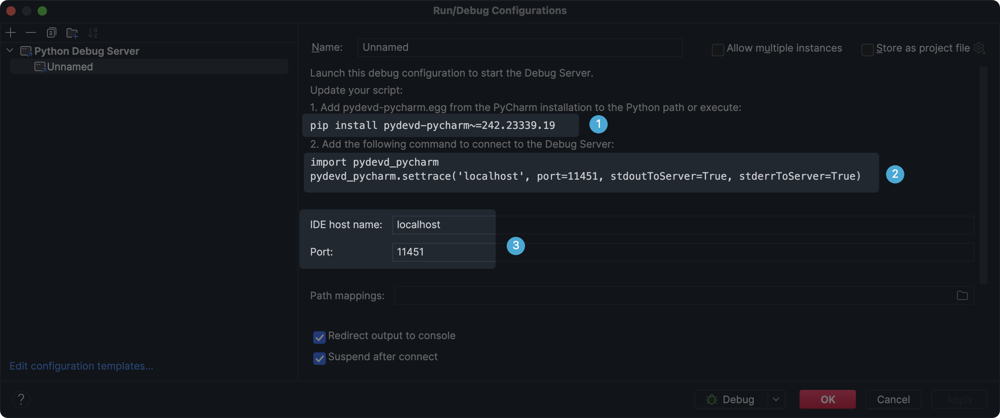


## 3、修改 GDB Script 代码


将上图中的 2 位置代码增加到待调试的 GDB Script 代码。本教程调试的是 lvgl 的 gdb 代码，对应位置在 `lvgl/script/gdb/lvgl.py`


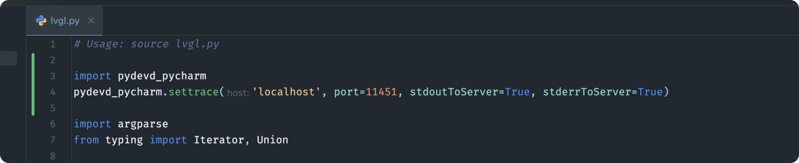


## 4、添加 Python 包路径


启动 gdb 调试后，需要将包路径添加到 gdb 的 Python 解释器中，这样才能正确的 `import pydevd_pycharm`。


当本教程安装完第步后，终端中提示：


因此，Python 包都按装在了 `/home/parallels/.local/lib/python3.10/site-packages`（本教程路径，具体路径按照自己的执行结果确定）


然后在 gdb 交互式终端中输入：


```bash
py sys.path.append("/home/parallels/.local/lib/python3.10/site-packages/")
```


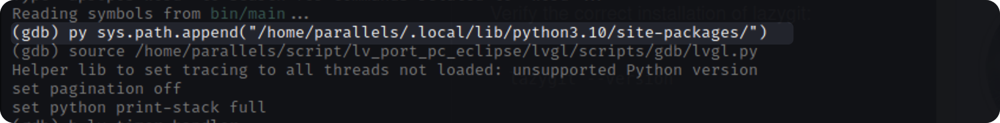


即可将 Python 的包引用路径添加到 gdb 的 Python 环境中。


## 5、单步调试


此时，万事俱备，只欠东风。


本教程调试一个简单的 lvgl demo，通过 `b lv_timer_handler` 命令，将调试器断点在此处。


运行两轮代码。


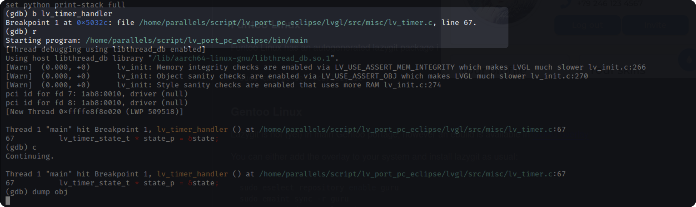


然后引入 lvgl.py 的 GDB Script。


```bash
source /home/parallels/script/lv_port_pc_eclipse/lvgl/scripts/gdb/lvgl.py
```


同时，我们在 PyCharm 中对 DumpObj 类的 invoke 方法下断点。


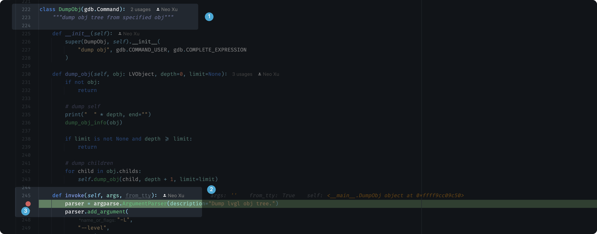


此时，执行 `lvgl.py` 提供的 `dump obj` 命令。


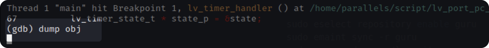


会发现，PyCharm 端点停留在了，上图的 3 号位置。


接下来就可以按照正常使用 PyCharm 的方式调试 GDB Python Script 了。


调试截图：


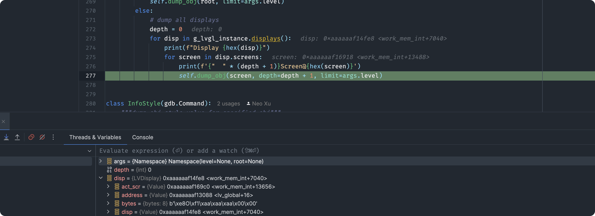


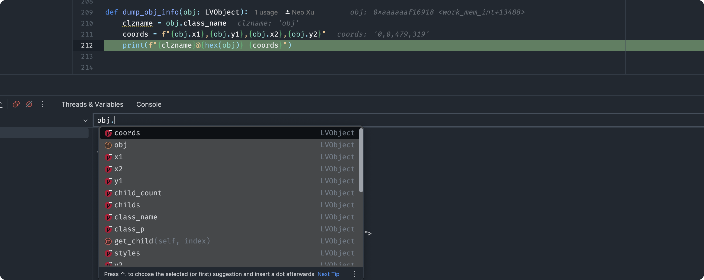

