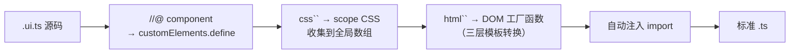
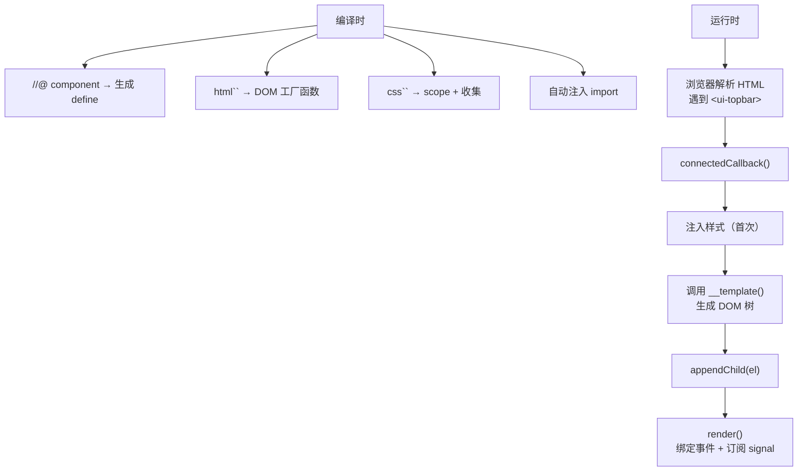
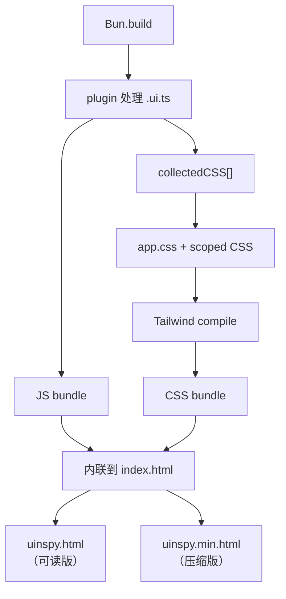

### 需求

我在给 LVGL 做一个运行时状态可视化工具：[uinspy](https://github.com/W-Mai/uinspy)。GDB 脚本从 coredump 里提取对象树、样式、动画等数据，序列化成 JSON，然后浏览器渲染成交互式面板。

几个硬性约束：

- **单个 HTML 文件：** 拖进浏览器就能用，不需要任何服务器
- **零外部依赖：** 不能 CDN 引入任何东西
- **产物人类可读：** 方便 git diff 和 code review

这意味着 React、Vue、Svelte 全都不行。它们的运行时少则几 KB 多则几十 KB，塞进一个 HTML 文件里太臃肿了。而且我不需要虚拟 DOM、不需要 SSR、不需要路由，我只需要把一坨 JSON 渲染成 DOM。

但纯手写 `document.createElement` 又太痛苦了。一个稍微复杂点的组件，光 DOM 操作就几十行，可读性约等于零。这不是假设，LVGL 官方仓库里那版 dashboard 就是这么写的：所有逻辑堆在一个巨大的 HTML 文件里，纯 DOM API 拼界面。功能少的时候还能忍，需求一多，可维护性急剧下降。

::sticker[v2_1e30d0ea-0645-401a-a20a-c1777a7221dl.gif]::

所以我决定自己造一个框架。不是那种大而全的框架，而是一个**编译时框架**：写的时候有模板语法、有组件抽象、有响应式状态，但构建完之后这些全部消失，产物里只剩原生 DOM 操作。

### 设计：`.ui.ts` 组件语法

先看最终的组件长什么样：

```typescript
//@ component("ui-theme-toggle")
class UiThemeToggle extends BaseComponent {
  static __style = css`
    .theme-toggle {
      @apply flex items-center justify-center w-8 h-8 rounded-lg cursor-pointer;
    }
    .theme-toggle:hover { @apply border-blue text-blue; }
  `;

  static __template = html`<button class="theme-toggle" title="Toggle theme">🌙</button>`;

  render() {
    const btn = this.$<HTMLButtonElement>(".theme-toggle");
    btn.onclick = () => { /* toggle logic */ };
  }
}
```

几个关键设计：

- **`//@ component("tag-name")`：** 注解声明 tag name，构建时自动生成 `customElements.define`
- **`` html`...` ``：** 模板语法，构建时编译成 `document.createElement` 调用
- **`` css`...` ``：** 样式声明，构建时自动用组件 tag 前缀做 scope
- **`render()`：** 组件挂载后的绑定逻辑，纯手写
- **不需要写 import：** plugin 根据用了什么自动注入

文件后缀是 `.ui.ts`，这是一个约定：只有这个后缀的文件会经过编译时转换，普通 `.ts` 不受影响。:sticker[v2_1b816ee1-7f2f-4f92-a2c3-c0330d4c574l.gif]:

### 为什么不用 Shadow DOM

最初版本用了 Shadow DOM 做样式隔离。写了两个组件就受不了了：

- Tailwind 的 utility class 是全局的，Shadow DOM 里看不到外面的 `<style>`
- 想共享 design token？对不起，每个 shadow tree 都是孤岛
- DevTools 里多了一层 shadow-root，调试体验很差

所以第二个 commit 就把 Shadow DOM 干掉了，换成编译时 CSS scope：用组件的 tag name 给选择器加前缀。

> CSS scope 的完整实现见 [不用 Shadow DOM 的组件样式隔离：编译时 CSS 自动 Scope](/blog/css-auto-scope)

迁移很简单：删掉 `attachShadow`，`this.root` 改成 `this`，完事。样式隔离从运行时封装变成了编译时前缀，Tailwind 正常工作，全局样式正常穿透。

### 编译管线

整个构建流程由 Bun plugin 驱动。`.ui.ts` 文件在被打包之前，会经过一系列源码变换：



每一步都是纯文本变换，不依赖 TypeScript 的 AST（太重了）。外层用正则定位模式（找到 `//@ component`、`` css` ``、`` html` `` 的位置），内层用手写的递归下降 parser 做真正的解析（HTML 模板解析、CSS scope 处理）。

> 模板编译的完整实现（HTML parser、代码生成、降级策略）见 [Bun Plugin 编译时模板转换](/blog/bun-plugin-compile-time-template)

### 运行时：不到 70 行

编译时做了这么多事，运行时反而极简。整个框架的运行时只有三个模块，加起来不到 70 行：

**BaseComponent（~40 行）：** 所有组件的基类。

```typescript
export abstract class BaseComponent extends HTMLElement {
  protected el!: HTMLElement;
  private static __injected = new Set<string>();

  connectedCallback() {
    const ctor = this.constructor as typeof BaseComponent & {
      __style?: string;
      __template?: () => HTMLElement;
    };
    // Inject style once per tag
    const tag = this.tagName.toLowerCase();
    if (ctor.__style && !BaseComponent.__injected.has(tag)) {
      BaseComponent.__injected.add(tag);
      const s = document.createElement("style");
      s.textContent = ctor.__style;
      document.head.appendChild(s);
    }
    // Mount template
    if (ctor.__template) {
      this.el = ctor.__template();
      this.appendChild(this.el);
    }
    this.render();
  }

  protected abstract render(): void;

  update() {
    this.innerHTML = "";
    const ctor = this.constructor as typeof BaseComponent & { __template?: () => HTMLElement };
    if (ctor.__template) {
      this.el = ctor.__template();
      this.appendChild(this.el);
    }
    this.render();
  }

  protected $<T extends HTMLElement>(selector: string): T {
    return this.querySelector(selector) as T;
  }
}
```

做三件事：

1. **样式注入：** 每个 tag 的 CSS 只注入一次（`Set` 去重）。正常构建流程下 `__style` 是空字符串（CSS 已经被收集走了），这段代码压根不会执行
2. **模板挂载：** 调用编译后的 DOM 工厂函数，把元素挂到 light DOM
3. **`update()`：** 清空 DOM → 重新挂载模板 → 重新跑 `render()`，简单粗暴但够用

`this.$()` 是个语法糖，省得每次都写 `this.querySelector`。


**signal（~15 行）：** 最小响应式原语。

```typescript
export function signal<T>(initial: T) {
  let value = initial;
  const listeners = new Set<() => void>();
  return {
    get val() { return value; },
    set val(v: T) {
      if (v === value) return;
      value = v;
      listeners.forEach(fn => fn());
    },
    sub(fn: () => void) {
      listeners.add(fn);
      fn(); // immediate call
      return () => listeners.delete(fn);
    },
  };
}
```

用 getter/setter 拦截读写，值变了就通知所有订阅者。`sub()` 会立即执行一次回调（拿到当前值），返回取消订阅的函数。

没有 computed、没有 effect、没有依赖追踪。为啥？因为不需要。组件的绑定逻辑在 `render()` 里手写，`sub()` 就是最直接的「值变了 → 更新 DOM」。:sticker[getimgdata-7.jpg]:

**store（~8 行）：** signal 的批量版。

```typescript
export function store<T extends Record<string, unknown>>(init: T): Store<T> {
  const s = {} as Store<T>;
  for (const k in init) s[k] = signal(init[k]) as Store<T>[typeof k];
  return s;
}
```

传一个对象进去，每个 key 变成一个独立的 signal。用于跨组件共享状态：

```typescript
// state.ts
export const dashData = signal<DashboardData | null>(null);
export const selectedAddr = signal<string | null>(null);

// any component
dashData.sub(() => {
  const data = dashData.val;
  if (!data) return;
  // update DOM...
});
```

就这些。不到 70 行运行时，没有虚拟 DOM，没有 diff 算法，没有调度器。组件自己知道什么时候该更新什么。:sticker[v2_18ec4f39-a600-430c-bbce-f68fe3557dfl.gif]:

::sticker[getimgdata-11.gif]::

### 组件的生命周期

一个组件从定义到渲染，经历了这些阶段：



编译时做了所有「翻译」工作，运行时只做「执行」。没有模板解析，没有响应式编译，没有 proxy 拦截。

### 实际组件长什么样

拿 topbar 举例，这是 uinspy 里最复杂的组件之一：

```typescript
//@ component("ui-topbar")
class UiTopbar extends BaseComponent {
  static __style = css`
    .topbar {
      @apply sticky top-0 z-50 flex items-center gap-4 h-11 px-5;
      background: var(--topbar-bg);
      backdrop-filter: blur(12px);
    }
    .topbar-nav { @apply flex gap-0.5 ml-auto; }
    .topbar-nav a { @apply text-subtext0 rounded-md px-2.5 py-1 text-[11px]; }
    .topbar-nav a:hover { @apply bg-surface0 text-txt; }
    @media (max-width: 768px) { .topbar-nav { @apply hidden; } }
  `;

  static __template = html`
    <header class="topbar">
      <div class="topbar-brand">
        <span class="logo">${__UINSPY_LOGO__}</span> ${__UINSPY_TITLE__}
      </div>
      <nav class="topbar-nav" id="topbar-nav"></nav>
      <ui-theme-toggle></ui-theme-toggle>
      <input type="text" class="topbar-search" id="search" placeholder="Filter..."/>
    </header>
  `;

  render() {
    const nav = this.$<HTMLElement>("#topbar-nav");
    const search = this.$<HTMLInputElement>("#search");

    dashData.sub(() => {
      const data = dashData.val;
      if (!data) return;
      nav.innerHTML = "";
      SECTIONS.forEach(s => {
        const count = (data as any)[s.key]?.length || 0;
        if (count === 0) return;
        const a = document.createElement("a");
        a.textContent = s.icon + " " + count;
        nav.appendChild(a);
      });
    });

    search.addEventListener("input", () => {
      const q = search.value.toLowerCase();
      document.querySelectorAll(".panel").forEach(p => {
        p.classList.toggle("hidden", !!q && !p.textContent!.toLowerCase().includes(q));
      });
    });
  }
}
```

几个值得注意的地方：

- **`${__UINSPY_LOGO__}` 和 `${__UINSPY_TITLE__}`：** Bun 的 `define` 常量，构建时直接替换成字面值，模板编译器把它们当 `expr` 节点处理
- **`<ui-theme-toggle>`：** 组件组合，直接在模板里写其他组件的 tag，浏览器会自动实例化 Custom Element
- **`dashData.sub()`：** 订阅全局状态，数据变了就重建导航栏。没有 diff，直接 `innerHTML = ""` 然后重建，这种小列表完全不需要操心性能
- **`@apply` 和 CSS 变量混用：** Tailwind utility 和自定义 design token 和平共处

### 不需要写的东西

plugin 帮你省掉了很多样板代码：

| 你不需要写 | plugin 帮你做 |
|-----------|-------------|
| `import { BaseComponent } from "..."` | 检测到 `BaseComponent` 自动注入 |
| `import { signal } from "..."` | 检测到 `signal(` 自动注入 |
| `customElements.define("tag", Class)` | 从 `//@ component` 生成 |
| `protected render()` | 自动加 `protected` |
| CSS scope 前缀 | 自动用 tag name 加前缀 |
| 相对路径计算 | 根据文件位置自动算 |

一个 `.ui.ts` 文件里只需要写**业务逻辑**，框架的胶水代码全部在编译时生成。

### 构建产物

整个构建流程：



两个版本并行构建：

- **可读版：** 只做语法压缩，保留变量名和缩进，方便 git diff
- **压缩版：** 全压缩，体积最小

篇一阶段（纯框架 + demo 组件）的产物体积：

```
dist/uinspy.html      24.4 KB (readable, git-friendly)
dist/uinspy.min.html  19.4 KB (minified)
```

19.4 KB 压缩版里包含了：框架运行时、4 个组件、Tailwind 编译后的 CSS、HTML 模板。整个应用就是一个文件，拖进浏览器就能跑。

加上后续的 LVGL dashboard 全部业务代码（对象树、3D 场景、屏保、键盘控制……）：

```
dist/uinspy.html      114.1 KB (readable, git-friendly)
dist/uinspy.min.html  84.2 KB  (minified)
```

84.2 KB 装下了一个完整的交互式调试面板。React 光运行时就比这大了。:sticker[v2_f311b7e9-a432-4bea-984c-b5fd9c3290bl.gif]:

### 演进路线

框架不是一开始就长这样的。从第一个 commit 到篇一结束（17 个 commit），经历了几个关键转折：

| 阶段 | commit | 变化 |
|------|--------|------|
| 初始化 | `1c8fee2` | 手写 Web Component + Shadow DOM + signal |
| 编译时语法糖 | `bab217e` | 引入 `.ui.ts` + Bun plugin，`@tag`/`@style`/`css` |
| IDE 友好 | `728d7da` | 改成 `//@ component()` 注解 + auto-import |
| 目录分离 | `56d34c4` | framework/ 和 src/ 独立，框架可复用 |
| 模板编译 | `9b7e14a` | `` html` `` → `createElement` 代码生成 |
| 去 Shadow DOM | `2048075` | 改用 tag prefix scope，支持 Tailwind |
| 嵌套模板 | `ebe71bd` | `this.html` 内联模板 + 健壮的 CSS scope |
| store | `2737fbb` | 跨组件共享状态 |
| 运行时兜底 | `a0c0ac0` | `html()` fallback，编译失败不崩 |

最有意思的是 `2048075`：去掉 Shadow DOM。改动不大，但这是整个样式架构的转向。从「运行时封装」变成「编译时前缀」，连带着解锁了 Tailwind 支持、全局 design token、更好的调试体验。

::sticker[v2_3b4cfeb1-76e1-41a4-9596-a3fdb458f05l.gif]::

### 和现有方案的对比

| 方案 | 运行时大小 | 模板方式 | 样式隔离 | 单文件产物 |
|------|-----------|---------|---------|-----------|
| React | ~40 KB | JSX（运行时） | CSS-in-JS / Modules | ❌ 需要打包器 |
| Vue | ~30 KB | SFC（编译时） | Scoped `<style>` | ❌ 需要打包器 |
| Svelte | ~2 KB | 编译时 | Scoped（编译时） | ⚠️ 可以但不原生 |
| Lit | ~5 KB | `` html` `` （运行时） | Shadow DOM | ⚠️ 运行时解析 |
| **uinspy** | **不到 70 行** | `` html` `` （编译时） | Tag prefix（编译时） | ✅ 原生支持 |

uinspy 的框架不是通用方案，它是为「单文件零依赖应用」这个特定场景量身定做的。没有路由、没有 SSR、没有 hydration，因为不需要。

但它证明了一件事：**如果你愿意把复杂度从运行时移到编译时，框架可以小到几乎不存在。**

::sticker[v2_833ed88f-8315-4a5d-aced-dd9512438acl.gif]::

### 总结

不到 70 行运行时，400 行编译器，撑起了一个完整的组件化应用。

核心思路就一句话：**编译时能做的事，绝不留到运行时。** 模板解析、CSS scope、import 注入、组件注册，全部在 `bun build` 的时候搞定。浏览器拿到的是纯粹的 DOM 操作代码，没有任何框架痕迹。

下一篇会讲怎么把一个巨大的静态 HTML dashboard 迁移到这个框架上，以及 CSS 架构从全局样式到 Tailwind design token 的演进。

::sticker[v2_68db2c19-5145-4b9e-8767-6379d921ccel.gif]::
