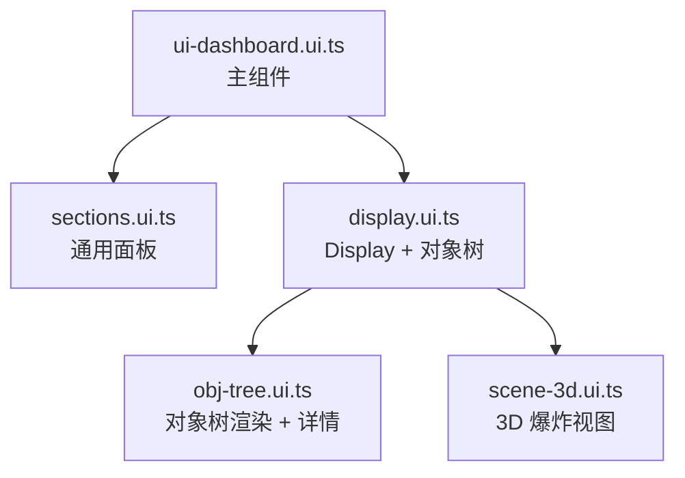
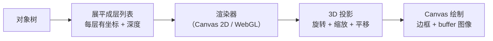

### 背景

[上一篇](/blog/uinspy-compile-time-ui-framework)讲了怎么从零造一个编译时 UI 框架。框架有了，接下来要做的事情是：把一个巨大的静态 HTML dashboard 迁移上来。

这个 dashboard 是干什么的？简单说：**可视化 LVGL 的运行时状态。**

LVGL 是一个嵌入式 GUI 库，跑在 MCU 上。我给 LVGL 官方仓库贡献了一套 GDB Python 调试脚本（在 `scripts/gdb/` 目录下），它能从 coredump 里提取 LVGL 的运行时数据：对象树、样式、动画、定时器、图片缓存、输入设备……所有你在 GDB 命令行里要敲几十条命令才能看到的东西。

> 关于 GDB Python 调试的详细内容，可以看之前写的 [用 PyCharm 调试 GDB Python 脚本](/blog/pycharm-debug-gdb-python)

但 GDB 命令行看这些数据太痛苦了。一棵对象树几百个节点，每个节点有坐标、样式、父子关系，在终端里滚屏看根本看不出什么。所以设计思路是：GDB 脚本提取数据 → 序列化成 JSON → 浏览器渲染成交互式面板。

::sticker[getimgdata-7.gif]::

最初的 dashboard 就是一个巨大的静态 HTML 文件。所有逻辑堆在一起：DOM 构建、样式、数据处理、交互逻辑，全在一个文件里。功能少的时候还能忍，但随着需求越来越多（3D 视图、屏保模式、多 display 支持、键盘控制……），这个文件膨胀到了不可维护的程度。

是时候用自己造的框架重构它了。

### 类型系统：先画地图再上路

迁移的第一步不是搬代码，而是定义类型。原来的 HTML 里所有数据都是 `any`，字段名靠肉眼对 JSON。重构的第一件事就是把 LVGL 的运行时数据结构用 TypeScript 接口描述清楚。

`types.ts` 定义了整个 dashboard 的数据模型：

```typescript
export interface DashboardData {
  meta?: { timestamp?: string; lvgl_version?: string };
  displays?: Display[];
  object_trees?: ObjectTree[];
  animations?: Animation[];
  timers?: Timer[];
  image_cache?: ImageCacheEntry[];
  // ... 12 个数据域
}
```

每个域对应 LVGL 的一个子系统。拿对象树举例：

```typescript
export interface ObjNode {
  addr: string;           // memory address
  class_name: string;     // lv_obj, lv_btn, lv_label...
  child_count: number;
  style_count: number;
  coords?: { x1: number; y1: number; x2: number; y2: number };
  parent_addr?: string;
  children?: ObjNode[];   // recursive
  styles?: ObjStyle[];
}
```

`ObjNode` 是递归结构：每个节点有 `children`，children 里又是 `ObjNode`。这和 LVGL 的对象树一一对应：screen → container → button → label，层层嵌套。

有了类型之后，所有 builder 函数的入参都是类型安全的。`data.displays` 不再是 `any`，IDE 能自动补全字段名，拼错了编译时就报错。这比原来在 HTML 里靠 `data["displays"]` 取值靠谱多了。:sticker[getimgdata-7.jpg]:


### 常量注册表：用数据驱动 UI

除了类型，还有一层抽象：`constants.ts`。它定义了 dashboard 的「元数据」：有哪些面板、每个面板对应哪个数据域、用什么图标、什么颜色。

```typescript
export const SECTIONS = [
  { key: "displays",    icon: "🖥", title: "Displays & Objects", cls: "panel-disp-trees" },
  { key: "animations",  icon: "🎬", title: "Animations",        cls: "panel-animations" },
  { key: "timers",      icon: "⏱",  title: "Timers",            cls: "panel-timers" },
  // ... 12 sections
];

export const STAT_DEFS = [
  { label: "Displays",   key: "displays",   icon: "🖥", color: "blue",  section: "disp-trees" },
  { label: "Objects",    key: "_objects",    icon: "🌳", color: "green", section: "disp-trees" },
  { label: "Animations", key: "animations",  icon: "🎬", color: "mauve", section: "animations" },
  // ...
];
```

这样做的好处是：新增一个面板只需要在注册表里加一行，不需要改 dashboard 组件的渲染逻辑。顶部的统计卡片、导航栏的锚点、面板的标题和图标，全部从这个注册表驱动。

### Builder 模式：四大模块

原来的 HTML 里，所有面板的构建逻辑混在一起。重构后拆成了四个 builder 模块，每个模块负责一类面板：



**sections.ui.ts：** 最大的一个模块，负责十来个「通用」面板。动画、定时器、输入设备、图片缓存、绘制任务……这些面板结构类似：标题栏 + 卡片列表或表格。

核心是一个 `buildCard` 辅助函数，抽象了卡片的通用结构：

```typescript
export function buildCard(item: { addr?: string }, config: {
  cardClass: string;
  anchorPrefix?: string;
  badges?: { text: string; color: string }[];
  content?: (info: HTMLElement, item: any) => void;
}): HTMLElement {
  const card = el("div", config.cardClass);
  // header with address + badges
  // body with custom content callback
  return card;
}
```

每种面板只需要传不同的 `content` 回调，定义自己的内容区域。比如动画面板会渲染进度条和当前值，定时器面板会渲染回调函数名和周期。结构统一，细节各异。

**display.ui.ts：** Display 面板比较特殊，因为它是一个「mega panel」：顶部是 display tab 栏（支持多个 display 切换），下面是三栏布局：对象树 + 3D 视图 + 详情面板。

```typescript
// Three-column split layout
const split = html`<div class="obj-split"></div>`;
split.append(treeView, view3d, detailPanel);
```

每个 display 有自己的对象树和 buffer 图像。切换 tab 的时候，整个内容区域重建。这里用了 signal 做选中状态的联动：

```typescript
selectedAddr.sub(() => {
  if (selectedAddr.val && detailPanel)
    renderObjDetail(selectedAddr.val, detailPanel);
});
```

点击对象树的节点 → `selectedAddr` 变化 → 详情面板自动更新。点击 3D 视图的层 → 同样触发 `selectedAddr` → 对象树高亮 + 详情面板更新。所有联动通过一个 signal 串起来，不需要手动同步。

**obj-tree.ui.ts：** 对象树的渲染。LVGL 的对象树是递归结构，渲染也是递归的：

```typescript
export function renderObjTree(obj: ObjNode, depth = 0): HTMLElement {
  const det = document.createElement("details");
  det.className = "obj-node";
  // depth color indicator
  sum.style.setProperty("--depth-color", DEPTH_COLORS[depth % DEPTH_COLORS.length]);
  // recursive children
  obj.children?.forEach(ch => det.appendChild(renderObjTree(ch, depth + 1)));
  return det;
}
```

用 `<details>` 元素做折叠，每层深度用不同颜色的圆点标记。鼠标悬停高亮对应的 3D 层，双击聚焦。这些交互通过 `state.ts` 里的事件系统串联。

::sticker[getimgdata-4.gif]::

**scene-3d.ui.ts：** 最复杂的模块，接近 700 行。负责把对象树渲染成 3D 爆炸视图。这个模块的内容太多了，渲染器的演进（CSS 3D → Canvas 2D → Three.js WebGL）会在后续文章单独展开。这里只说它在 dashboard 里的角色：

- 接收对象树数据，展平成层列表
- 每层有坐标、深度、颜色、可见性
- 支持旋转、缩放、平移、深度过滤
- 支持鼠标 hover 拾取、点击选中、双击聚焦
- 支持键盘控制（WASD + 方向键 + 惯性）
- 支持屏保模式

### 主组件：Bento Grid 布局

四个 builder 模块准备好之后，主组件 `ui-dashboard.ui.ts` 就很简单了：订阅数据，调用 builder，把面板塞进 grid。

```typescript
render() {
  const grid = this.el;
  dashData.sub(() => {
    const data = dashData.val;
    if (!data) return;
    grid.innerHTML = "";
    const bento = el("div", "bento");

    // stat cards
    STAT_DEFS.forEach(s => {
      const val = s.key === "_objects" ? objCount : ((data as any)[s.key]?.length || 0);
      bento.appendChild(makeStatPanel(s.icon, s.label, val, s.color, s.section));
    });

    // panels
    bento.appendChild(buildDisplayAndTrees(data));
    bento.appendChild(buildImageCache(data));
    bento.appendChild(buildAnimations(data));
    // ... 12 panels
    grid.appendChild(bento);
  });
}
```

布局用 CSS Grid 的 12 列 bento grid：

```css
.bento { @apply grid grid-cols-12 gap-[var(--gap)]; }
.panel-stat { grid-column: span 2; }           /* 6 stat cards = 12 cols */
.panel-disp-trees { grid-column: span 12; }    /* full width */
.panel-animations { grid-column: span 4; }     /* 3 per row */
```

统计卡片占 2 列（一行 6 个），Display 面板占满 12 列，其他面板各占 4 列（一行 3 个）。响应式断点在 1200px 和 768px，小屏自动折叠成更少的列数。

::sticker[v2_b142fbb3-70dc-46ef-a023-6bf352cfc3cl.gif]::


### CSS 架构演进

CSS 的演进是这次重构里最有意思的部分之一。经历了三个阶段：

**阶段一：全局 CSS**

最初所有样式都在 `dashboard.css` 里，一个文件几百行。面板样式、表格样式、卡片样式、3D 场景样式全混在一起。改一个选择器要全局搜索怕影响别的地方。

**阶段二：Colocated `css\`\``**

迁移到框架之后，每个 builder 模块可以用 `` css` `` 声明自己的样式。display 的样式在 `display.ui.ts` 里，对象树的样式在 `obj-tree.ui.ts` 里，3D 场景的样式在 `scene-3d.ui.ts` 里。

```typescript
// display.ui.ts
const __css = css`
  .disp-tab-bar { @apply flex gap-1 mb-2 pb-2 border-b-s0; }
  .disp-tab-btn { @apply flex items-center gap-1.5 font-mono text-[11px]; }
  // ...
`;
```

样式和逻辑放在一起，改组件的时候不用在两个文件之间跳来跳去。编译时自动 scope，不用担心命名冲突。

`dashboard.css` 瘦身成只保留全局共享的样式：面板基础结构（`.panel`、`.panel-header`、`.panel-body`）、表格、badge、滚动条这些跨组件复用的东西。

**阶段三：Tailwind v4 @theme + design token**

最后一步是引入 Tailwind v4 的 `@theme` 指令，把所有颜色变量桥接成 Tailwind token：

```css
@theme {
  --color-crust: var(--crust);
  --color-mantle: var(--mantle);
  --color-base: var(--base);
  --color-surface0: var(--surface0);
  --color-panel-bg: var(--panel-bg);
  // ...
}
```

这样在组件里就可以直接用 `@apply bg-panel-bg text-txt border-s0`，不用写 `background: var(--panel-bg)` 这种原始 CSS。

同时定义了几个 `@utility` token，把重复出现的模式抽成工具类：

```css
@utility border-s0 { border: 1px solid var(--surface0); }
@utility border-b-s0 { border-bottom: 1px solid var(--surface0); }
@utility transition-theme { transition: all var(--transition); }
```

这一步让 CSS 体积减少了大约 15%，因为 Tailwind 的 `@apply` 会去重：多个组件用了相同的 utility 组合，产物里只出现一次。

### 三套主题

`app.css` 里定义了三套主题的 CSS 变量：

| 主题 | 风格 | 圆角 |
|------|------|------|
| Dark（默认） | Catppuccin Mocha | 12px |
| Light | Catppuccin Latte | 12px |
| Cyber | 赛博霓虹 | 4px |

切换主题只需要改 `data-theme` 属性，所有面板的颜色、阴影、发光效果自动跟着变。Cyber 主题比较特别：圆角从 12px 缩到 4px，加了扫描线效果（`body::after` 的条纹背景）、文字发光（`text-shadow`）、面板内发光（`box-shadow: inset`）。

因为所有颜色都走 CSS 变量，新增主题只需要定义一组变量值，不需要改任何组件代码。这就是 design token 的好处：**把「什么颜色」和「用在哪里」解耦。**

> 这个思路和我之前重构博客 CSS 时用的一模一样。那次是把 500 行 `global.css` 拆成 token + 语义化 class，让加新主题变成「改一个文件，零组件改动」。uinspy 的 `@theme` 桥接本质上是同一套方法论在不同项目里的实践。详见 [把 500 行 CSS 拆成 6 个文件：一次拟态风格博客的样式架构改造](/blog/css-architecture-refactor)

::sticker[v2_18ec4f39-a600-430c-bbce-f68fe3557dfl.gif]::

### 3D 爆炸视图

3D 爆炸视图是 dashboard 的核心交互。它把对象树的层级关系用空间深度表达出来：父节点在底层，子节点在上层，通过 Z 轴间距（spread）拉开。



展平逻辑在 `flattenLayers` 函数里：递归遍历对象树，给每个节点算一个全局深度值。多个 screen 之间用 `SCREEN_GAP` 隔开，避免层叠在一起。

控制面板提供了一堆交互：

- **3D/2D 切换：** 平滑动画过渡，不是硬切
- **Z Spread 滑块：** 控制层间距
- **深度范围过滤：** 双滑块，只显示指定深度范围的层
- **Screen 过滤：** 每个 screen 可以单独显示/隐藏，双击 solo
- **Buffer 图像开关：** 显示/隐藏 display buffer 的截图
- **正交/透视切换：** `cam.persp` 是 0~1 的连续值，平滑过渡

渲染器的具体实现（CSS 3D → Canvas 2D → Three.js WebGL 的三级跳）会在后续文章详细展开。这里只需要知道：渲染器实现了 `ISceneRenderer` 接口，dashboard 不关心底层用什么技术画，只管传数据和处理交互。

### 屏保模式

全屏状态下闲置 30 秒，自动进入屏保模式。3D 视图开始缓慢旋转和呼吸式缩放，控制面板和工具栏隐藏，只剩下纯粹的 3D 场景。

```typescript
const enterSS = (manual = false) => {
  container.classList.add("screensaver");
  const tick = (now: number) => {
    const t = (now - t0) / 1000;
    cam.rotX = baseRx + 12 * Math.sin(t * 0.065) + 5 * Math.sin(t * 0.155);
    cam.rotY = baseRy + 8 * Math.sin(t * 0.085) + 2 * Math.sin(t * 0.205);
    // breathing spread
    updateDepths(baseSp + baseSp * 0.3 * Math.sin(t * 0.055));
    ssAnimId = requestAnimationFrame(tick);
  };
};
```

动画用多个不同频率的正弦波叠加，避免看起来太机械。旋转和 spread 各有两个频率分量，产生一种「漂浮感」。

屏保有两种触发方式：

- **自动触发：** 全屏后 30 秒无操作，鼠标/键盘任意动作退出
- **手动触发：** 点击 🎬 按钮，只有 ESC（退出全屏）才能退出

屏保模式是一个编译时特性：通过 `__UINSPY_SCREENSAVER__` 编译常量控制。设置 `UINSPY_NO_SCREENSAVER=1` 构建时，整段屏保代码会被 tree-shaking 掉，不进入产物。

::sticker[v2_980e4836-9895-4459-9730-84817921cffl.gif]::

### DOM 辅助函数

重构过程中沉淀了一套 DOM 辅助函数（`helpers.ts`），让 builder 代码更简洁：

```typescript
// create element with class and text
el("div", "panel-header", "Title")

// cross-reference link (clickable address)
xref("0x3fc12000", "obj")  // → <a class="xref" href="#obj-0x3fc12000">0x3fc12000</a>

// key-value pair
kvPair("callback", "my_timer_cb")

// badge
badge("running", "green")

// panel with header + body
const { panel, body } = makePanel("panel-animations", "🎬", "Animations", 5);
```

`xref` 是一个很有用的抽象：LVGL 的数据里到处都是内存地址的交叉引用（对象的 parent_addr 指向另一个对象，timer 的 display_addr 指向一个 display）。`xref` 把这些地址渲染成可点击的链接，点击后跳转到对应面板的对应条目。`XREF_TARGET` 常量表定义了每个字段名对应的锚点前缀。

### CI/CD

最后是部署。两个 GitHub Actions workflow：

**pages.yml：** 每次 push 到 main，自动构建并部署到 GitHub Pages。构建时开启 logo + Three.js WebGL 渲染器：

```yaml
- run: UINSPY_LOGO_FAVICON=1 UINSPY_THREE=1 bun run build
- run: cp dist/uinspy.html dist/index.html
```

**release.yml：** 发布 release 时，自动构建 6 个 HTML 变体作为 release assets：

| 变体 | Logo | 屏保 | WebGL |
|------|------|------|-------|
| uinspy.html | ❌ | ❌ | ❌ |
| uinspy-screensaver.html | ❌ | ✅ | ❌ |
| uinspy-logo.html | ✅ | ❌ | ❌ |
| uinspy-logo-screensaver.html | ✅ | ✅ | ❌ |
| uinspy-webgl.html | ❌ | ❌ | ✅ |
| uinspy-webgl-logo-screensaver.html | ✅ | ✅ | ✅ |

为什么要这么多变体？因为不同场景需求不同：

- **标准版：** 最小体积，适合嵌入 LVGL 官方仓库
- **带 logo 版：** 有品牌标识，适合独立分发
- **带屏保版：** 展示用，放在大屏上当背景
- **WebGL 版：** 3D 渲染效果最好，但体积最大（包含 Three.js）

所有变体都是单个 HTML 文件，拖进浏览器就能用。编译时特性开关让同一套代码产出不同的产物，不需要维护多个分支。:sticker[v2_8f1f8006-246a-40d5-9f9d-fb73f64291dl.gif]:

::sticker[v2_71f470db-c772-4c26-8712-5f99d81c6e5l.gif]::

### 总结

从一个巨大的静态 HTML 到模块化 dashboard，核心变化是三层解耦：

1. **数据层：** `types.ts` 定义结构，`constants.ts` 驱动 UI 元数据
2. **渲染层：** 四个 builder 模块各司其职，通过 signal 联动
3. **样式层：** 从全局 CSS 到 colocated scope CSS 到 Tailwind design token

下一篇会聊渲染器的三级跳：从 CSS 3D transform 到 Canvas 2D 手写投影到 Three.js WebGL，以及为什么每次升级都是被逼的。

::sticker[v2_3b4cfeb1-76e1-41a4-9596-a3fdb458f05l.gif]::
